# Kali AI-OS: Voice-Controlled Cybersecurity Operating System

## 📋 Table of Contents

1. [Project Overview](#project-overview)
2. [System Architecture](#system-architecture)
3. [Technical Specifications](#technical-specifications)
4. [Desktop Control System](#desktop-control-system)
5. [Implementation Timeline](#implementation-timeline)
6. [Core Components](#core-components)
7. [Cybersecurity Integration](#cybersecurity-integration)
8. [Secure API Authentication](#secure-api-authentication)
9. [Safety & Security Framework](#safety--security-framework)
10. [Testing & Quality Assurance](#testing--quality-assurance)
11. [Demo Scenarios](#demo-scenarios)
12. [Resources & References](#resources--references)
13. [Getting Started Guide](#getting-started-guide)

---

## 🎯 Project Overview

### Project Details
- **Name**: Kali AI-OS - Voice-First Cybersecurity Operating System
- **Target**: Hackathon Competition Win
- **Timeline**: 10 Weeks
- **Innovation**: First truly voice-native cybersecurity OS with full desktop automation

### Core Vision
Create a fully functional AI-controlled cybersecurity operating system where security professionals can perform complex penetration testing through natural voice conversation AND direct GUI automation, making advanced security testing accessible through both voice commands and automated desktop interactions.

### Key Differentiators
- **Voice-First Interface**: Natural language commands for all security operations
- **Desktop Automation**: AI can directly control mouse, keyboard, and GUI applications
- **Dual Desktop Architecture**: Concurrent user work and AI automation without interference
- **Secure Authentication**: Server-based API key management with memory-only storage
- **Comprehensive Safety**: Ethical hacking validation with legal compliance framework

---

## 🏗️ System Architecture

### Separated System Architecture Overview

The system is cleanly divided into two distinct components that communicate securely:

#### 1. **External Authentication Server** (Your Secure Backend)
- Independent FastAPI server hosting encrypted API keys
- User database and session management
- Completely separate from the Kali AI-OS

#### 2. **Kali AI-OS** (The Operating System)
- Modified Kali Linux with voice-controlled AI capabilities
- Receives encrypted keys from auth server (never stores them)
- Performs all cybersecurity operations locally

---

### Authentication Server Architecture


---

### Complete Kali AI-OS System Architecture


---

### Clean System Communication Flow

```mermaid
sequenceDiagram
    participant User
    participant KaliOS as Kali AI-OS
    participant AuthServer as Authentication Server
    participant AIEngine as AI Processing
    participant SecurityTools as Security Tools

    Note over User,SecurityTools: 1. AUTHENTICATION PHASE
    
    User->>KaliOS: "Login as security_expert"
    KaliOS->>AuthServer: POST /auth/login {username, password}
    AuthServer->>AuthServer: Validate credentials + retrieve encrypted keys
    AuthServer->>KaliOS: {success: true, encrypted_keys: "...", session_token: "..."}
    KaliOS->>KaliOS: Decrypt keys to RAM only (never disk)
    KaliOS->>User: "Authentication successful! AI services ready."

    Note over User,SecurityTools: 2. VOICE COMMAND PROCESSING
    
    User->>KaliOS: "Open Burp Suite and scan example.com"
    KaliOS->>KaliOS: Voice → Text → Intent Recognition
    KaliOS->>KaliOS: Safety validation + ethical checks
    KaliOS->>AIEngine: Process command with decrypted API keys
    AIEngine->>AIEngine: Generate GUI automation workflow
    
    Note over User,SecurityTools: 3. DESKTOP AUTOMATION EXECUTION
    
    KaliOS->>KaliOS: Switch to AI virtual desktop (:1)
    KaliOS->>SecurityTools: Automate Burp Suite GUI (click, type, configure)
    SecurityTools->>KaliOS: Tool ready + scan initiated
    KaliOS->>AIEngine: Process scan results
    AIEngine->>KaliOS: Generate natural language summary
    KaliOS->>User: "Burp Suite configured and scanning. Found 3 potential vulnerabilities..."

    Note over User,SecurityTools: 4. SESSION MANAGEMENT
    
    KaliOS->>KaliOS: Monitor user activity (concurrent desktop access)
    KaliOS->>AuthServer: Periodic session refresh
    AuthServer->>KaliOS: Extended session or timeout
    KaliOS->>KaliOS: Auto-wipe keys on timeout/shutdown
```



### Clear Separation Benefits

#### Authentication Server (Backend)
- **Independent Operation**: Runs separately from Kali AI-OS
- **Centralized Security**: All API key management in one secure location
- **Scalable Access**: Can serve multiple Kali AI-OS instances
- **Enterprise Control**: Admin dashboard, user management, audit trails

#### Kali AI-OS (Operating System)
- **Zero Trust Model**: Never stores API keys permanently
- **Local Processing**: Voice recognition and GUI automation handled locally
- **Isolated Execution**: Dual desktop prevents user interference
- **Complete Security**: All cybersecurity tools integrated with voice control

#### Clean Communication
- **Simple API**: Only 4 endpoints needed (/login, /refresh, /logout, /status)
- **Secure Transport**: HTTPS + JWT tokens for all communication
- **Memory-Only Keys**: API keys never touch disk on Kali AI-OS
- **Automatic Cleanup**: Keys wiped on timeout, logout, or shutdown

---

## 🔧 Universal Tool Integration System

### Supports ANY Security Tool

The architecture now includes a **Universal Tool Engine** that can handle:

#### 1. **Built-in Kali Tools** (600+ Pre-integrated)
- **All native Kali tools**: nmap, burpsuite, wireshark, metasploit, etc.
- **Pre-configured templates**: Command syntax and output parsing ready
- **Instant availability**: No setup required, works out of the box

#### 2. **Custom GitHub Tools** (Auto-Install + Config)
- **Dynamic installation**: `git clone` and auto-setup any GitHub repo
- **Dependency management**: Automatic requirement installation
- **Configuration detection**: AI learns tool parameters and usage

#### 3. **User Scripts** (Python/Bash/Go)
- **Custom workflows**: User's own automation scripts
- **Multi-language support**: Python, Bash, Go, Node.js, etc.
- **Parameter injection**: AI passes targets and parameters dynamically

#### 4. **Commercial Tools** (Licensed Software)
- **Professional tools**: Nessus, Acunetix, QualysGuard, etc.
- **License integration**: Handles authentication and API access
- **GUI automation**: Controls commercial tools through desktop automation

#### 5. **Web Applications** (Browser Automation)
- **Online tools**: Shodan, VirusTotal, threat intelligence platforms
- **API integration**: Direct API calls or browser automation
- **Session management**: Handles login cookies and tokens

#### 6. **Unknown Tools** (AI Learning Mode)
- **Real-time learning**: AI analyzes new tools and learns usage patterns
- **Help text parsing**: Reads `--help` output to understand parameters
- **Output pattern recognition**: Learns to parse results from any tool

### Universal Tool Engine Implementation

#### Tool Discovery Engine
```python
# Automatic tool detection and integration
class UniversalToolDiscovery:
    def discover_tools(self):
        # Built-in Kali tools
        kali_tools = self.scan_kali_tools()
        
        # Custom GitHub repositories
        github_tools = self.scan_github_repos()
        
        # User scripts and executables
        custom_scripts = self.scan_custom_tools()
        
        # Commercial software installations
        commercial_tools = self.detect_commercial_tools()
        
        return self.create_tool_registry(kali_tools, github_tools, custom_scripts, commercial_tools)
```

#### Dynamic Command Generation
```python
# AI-powered command syntax generation
class AICommandGenerator:
    def generate_command(self, tool_name, user_intent, target):
        # Use LLM to generate appropriate command
        prompt = f"Generate {tool_name} command for: {user_intent} against {target}"
        command = self.llm.generate(prompt, tool_context=self.tool_registry[tool_name])
        
        # Validate command safety
        return self.safety_validator.validate(command)
```

#### Universal Output Parser
```python
# Parse output from any security tool
class UniversalOutputParser:
    def parse_tool_output(self, tool_name, raw_output):
        # Try known parsers first
        if tool_name in self.known_parsers:
            return self.known_parsers[tool_name].parse(raw_output)
        
        # Use AI to parse unknown tool output
        return self.ai_parser.extract_findings(raw_output)
```

### Voice Command Examples for ANY Tool

#### Built-in Kali Tools
- **User**: "Run nikto against example.com"
- **System**: Auto-generates `nikto -h example.com -output results.txt`

#### Custom GitHub Tools
- **User**: "Use SecLists to fuzzy wordlist on example.com"
- **System**: Downloads SecLists if needed, runs appropriate fuzzing tool

#### User Scripts
- **User**: "Execute my custom port scanner on 192.168.1.0/24"
- **System**: Runs user's Python script with network range parameter

#### Commercial Tools
- **User**: "Start Nessus vulnerability scan on the target network"
- **System**: Automates Nessus GUI to configure and launch scan

#### Web Applications
- **User**: "Check VirusTotal reputation for suspicious-domain.com"
- **System**: Makes API call to VirusTotal or automates web interface

#### Unknown Tools
- **User**: "Use that new tool I downloaded yesterday to scan for SQLi"
- **System**: AI analyzes the tool, learns its syntax, generates appropriate command

### Dynamic Tool Integration Workflow


### Tool Categories Supported

#### **Category 1: Kali Built-ins** (600+ tools)
- Network tools, web tools, wireless tools, forensics, reverse engineering
- All pre-integrated with known command syntax and output parsing

#### **Category 2: GitHub Security Tools**
- Popular repositories: SecLists, PayloadsAllTheThings, nuclei-templates
- Automatic `git clone`, dependency installation, and integration

#### **Category 3: Custom User Scripts**
- User's personal automation scripts and tools
- Support for Python, Bash, Go, Node.js, Ruby, etc.

#### **Category 4: Commercial Software**
- Licensed tools: Nessus, Burp Pro, Acunetix, QualysGuard
- Both API integration and GUI automation support

#### **Category 5: Web-based Tools**
- Online platforms: Shodan, VirusTotal, URLVoid, etc.
- Browser automation for tools without APIs

#### **Category 6: Unknown/New Tools**
- AI learning mode for completely new or unknown tools
- Real-time analysis and integration

### Enhanced Voice Commands

**User can literally say:**
- "Download and use that SQLMap alternative from GitHub"
- "Run my Python script for subdomain enumeration"  
- "Use Nessus Professional to scan the entire network"
- "Check this hash on VirusTotal and Hybrid Analysis"
- "Install and run the latest version of nuclei with all templates"
- "Use that tool John mentioned in the conference yesterday"

**System Response:**
- Finds/downloads/installs the tool automatically
- Generates appropriate commands using AI
- Executes with proper safety validation
- Parses output and provides natural language summary
- Integrates results with other security tools

### Universal Tool Safety

#### Safety for ANY Tool
- **Command validation**: AI checks generated commands for safety
- **Scope verification**: Ensures tools only target authorized systems
- **Output sanitization**: Removes sensitive data from logs
- **Execution sandboxing**: Tools run in isolated environments
- **Emergency termination**: Can stop any tool immediately

---

## ⚙️ Technical Specifications

### Development Stack

#### Core Languages
- **Python 3.11+**: Primary development (AI, tools, GUI automation)
- **Bash**: Security tool scripting and system integration
- **JavaScript**: Real-time dashboard and visualization
- **SQL**: Authentication and audit database management

#### Essential Dependencies

**Voice & AI Processing**
```
vosk==0.3.45                  # Speech-to-text recognition
SpeechRecognition==3.10.0     # Audio input processing
pyttsx3==2.90                 # Text-to-speech output
openai==1.12.0               # GPT-4 integration
anthropic==0.8.1             # Claude AI integration
```

**Desktop Automation**
```
pyautogui==0.9.54            # GUI automation framework
pynput==1.7.6                # Input monitoring and control
opencv-python==4.8.1.78      # Image recognition and matching
Pillow==10.1.0               # Image processing
python-xlib==0.33            # X11 system integration
```

**Cybersecurity Tools**
```
python-nmap==0.7.1           # Network scanning
scapy==2.5.0                 # Packet manipulation
requests==2.31.0             # HTTP/HTTPS testing
paramiko==3.4.0              # SSH automation
beautifulsoup4==4.12.2       # Web content parsing
```

**System Integration**
```
fastapi==0.104.1             # Authentication server
uvicorn==0.24.0              # ASGI server
redis==5.0.1                 # Session coordination
SQLAlchemy==2.0.23           # Database ORM
cryptography==41.0.7         # Secure key handling
```

### Hardware Requirements

#### Minimum Configuration
- **CPU**: Quad-core 2.0GHz (concurrent scanning + desktop automation)
- **RAM**: 12GB (OS + security tools + AI processing + virtual desktop)
- **Storage**: 40GB (Kali tools + data/logs + virtual desktop)
- **Network**: Multiple interfaces (WiFi, Ethernet, USB adapters)
- **Audio**: Quality microphone for voice recognition
- **Display**: Dual monitor support recommended

#### Recommended Configuration
- **CPU**: 8-core 3.0GHz+ with virtualization support
- **RAM**: 24GB+ for large-scale operations
- **Storage**: 80GB+ NVMe SSD for fast execution
- **Network**: Dedicated penetration testing setup
- **GPU**: Discrete GPU for acceleration and image processing

### System Installation

#### Kali Linux Base Setup
```bash
# Update system
sudo apt update && sudo apt full-upgrade -y

# Install desktop automation
sudo apt install -y xvfb x11vnc xdotool wmctrl
sudo apt install -y python3-tk python3-pil python3-pil.imagetk
sudo apt install -y libgtk-3-dev libcairo2-dev libgirepository1.0-dev

# Install audio processing
sudo apt install -y pulseaudio pulseaudio-utils alsa-utils
sudo apt install -y portaudio19-dev python3-pyaudio
sudo apt install -y espeak espeak-data libespeak-dev

# Install security tools
sudo apt install -y burpsuite zaproxy wireshark
sudo apt install -y nmap masscan nikto dirb gobuster
sudo apt install -y metasploit-framework aircrack-ng
```

#### Virtual Desktop Configuration
```bash
# Create AI desktop service
sudo tee /etc/systemd/system/ai-desktop.service << 'EOF'
[Unit]
Description=AI Desktop Virtual Display
After=network.target

[Service]
Type=simple
User=kali
Environment=DISPLAY=:1
ExecStart=/usr/bin/Xvfb :1 -screen 0 1920x1080x24 -ac +extension GLX
Restart=always

[Install]
WantedBy=multi-user.target
EOF

sudo systemctl enable ai-desktop.service
sudo systemctl start ai-desktop.service
```

---

## 🖥️ Advanced User Interface & Display System

### Comprehensive Display Architecture Overview

The Kali AI-OS implements a sophisticated multi-desktop system that adapts to any hardware configuration - from single laptop screens to multi-monitor professional setups. The system intelligently manages user-AI coordination through multiple interaction modes.

---

### 🖥️ Dual Desktop Architecture

#### User Desktop (Primary - Display :0)
- **Purpose**: Normal user work, documentation, monitoring, report writing
- **Access**: Direct user mouse, keyboard, monitor control
- **Security**: User-controlled environment, no automated interference
- **Tools**: LibreOffice, browsers, text editors, user applications
- **Experience**: Completely normal desktop usage, unaware of AI automation

#### AI Virtual Desktop (Secondary - Display :1)
- **Purpose**: AI-controlled security tool automation and orchestration
- **Access**: PyAutoGUI automation, programmatic control only
- **Security**: Sandboxed environment, monitored, complete audit trail
- **Tools**: Burp Suite, OWASP ZAP, Wireshark, Metasploit GUI, terminals
- **Experience**: Invisible to user unless explicitly requested

---

### 💻 Single Monitor / Laptop Optimization

#### Smart Workspace Management
```python
class SingleMonitorManager:
    def __init__(self):
        self.workspaces = {
            'user': 1,      # User's primary workspace
            'ai_tools': 2,  # AI security tools workspace
            'results': 3,   # Evidence and results workspace
            'monitoring': 4 # Real-time monitoring workspace
        }
        self.display_mode = "single_monitor"
        
    def optimize_for_laptop(self):
        # Configure for resource-efficient operation
        self.enable_background_mode()
        self.setup_notification_system()
        self.configure_voice_first_operation()
```

#### Laptop-Friendly Interface Modes

##### **A. Background Operation Mode** (Default for laptops)
- AI runs security tools in hidden workspace
- User receives audio updates and notifications
- Visual interface available on-demand via voice commands
- Minimal resource impact on user's primary workspace

##### **B. Picture-in-Picture Mode**
- Small overlay window (300x200px) showing AI desktop
- Resizable and draggable without disrupting user work
- Click to expand temporarily, voice command to hide/show
- Perfect for monitoring AI progress while working

##### **C. Tab-Based Interface**
```
[User Work] [AI Tools] [Results] [Evidence] [Settings]
     ↑         ↑         ↑         ↑          ↑
  Active    Background  Real-time  Auto-saved  Config
```

##### **D. Notification-Driven Experience**
- Critical findings popup as toast notifications
- Progress indicators in system tray
- Audio alerts for important discoveries
- Full details available via voice command

---

### 🎮 User Interaction Modes

#### 1. **View-Only Mode** (Monitor AI Activity)
```python
class ViewOnlyMode:
    def enable_monitoring(self):
        # User can watch AI desktop without interfering
        self.setup_vnc_viewer()
        self.disable_user_input_to_ai_desktop()
        self.enable_real_time_streaming()
        
    def show_ai_desktop(self):
        return self.create_readonly_window(self.ai_display)
```

**User Experience:**
- Voice command: "Show me what AI is doing"
- Opens read-only window displaying AI desktop
- User can watch Burp Suite scanning, terminals running, etc.
- No mouse/keyboard interference with AI operations

#### 2. **Shared Control Mode** (Collaborative Operation)
```python
class SharedControlMode:
    def enable_collaboration(self):
        self.pause_ai_automation()
        self.transfer_control_to_user()
        self.maintain_session_context()
        
    def resume_ai_control(self):
        self.user_says("AI continue from here")
        self.analyze_user_changes()
        self.resume_automation_with_context()
```

**User Experience:**
- User: "Let me configure this tool manually"
- AI pauses, user takes control of AI desktop
- User makes manual configurations
- User: "AI continue with these settings"
- AI resumes with user's configurations

#### 3. **Teaching Mode** (AI Learns Workflows)
```python
class TeachingMode:
    def __init__(self):
        self.action_recorder = ActionRecorder()
        self.workflow_analyzer = WorkflowAnalyzer()
        self.knowledge_saver = WorkflowKnowledgeBase()
        
    def start_learning_session(self, workflow_name):
        self.action_recorder.start_recording()
        self.capture_screenshots = True
        self.record_voice_annotations = True
        
    def process_learned_workflow(self):
        actions = self.action_recorder.get_recorded_actions()
        workflow = self.workflow_analyzer.create_workflow(actions)
        self.knowledge_saver.save_persistent_workflow(workflow)
```

**User Experience:**
- User: "AI, learn how I configure Nessus for internal scans"
- AI: "Teaching mode activated, recording all actions"
- User demonstrates complete Nessus setup workflow
- AI: "Workflow learned and saved permanently as 'Nessus Internal Scan Setup'"

#### 4. **Emergency Override Mode**
```python
class EmergencyOverride:
    def immediate_stop(self):
        # Triggered by "AI stop everything immediately"
        self.terminate_all_ai_processes()
        self.save_current_state()
        self.return_control_to_user()
        self.log_emergency_stop()
```

---

### 🖱️ CLI + GUI Hybrid Automation

#### Intelligent Tool Interface Selection
```python
class IntelligentToolSelector:
    def choose_interface(self, tool_name, context):
        factors = {
            'user_activity_level': context.user_busy,
            'display_setup': context.monitor_count,
            'tool_capabilities': self.get_tool_interfaces(tool_name),
            'evidence_needs': context.requires_screenshots,
            'performance_mode': context.battery_level < 20
        }
        
        if factors['user_activity_level'] == 'high' and factors['display_setup'] == 1:
            return 'CLI'  # Less intrusive for busy single-monitor users
        elif factors['evidence_needs'] or factors['tool_capabilities'] == 'gui_only':
            return 'GUI'  # Visual evidence or GUI-only tools
        else:
            return 'CLI_with_screenshots'  # Best of both worlds
```

#### CLI Tool Automation (Most Security Tools)
```python
class CLIToolAutomation:
    def __init__(self):
        self.terminal_manager = VirtualTerminalManager()
        self.command_executor = SecureCommandExecutor()
        
    def execute_cli_tool(self, tool_name, parameters):
        # Create isolated terminal session on AI desktop
        terminal = self.terminal_manager.create_session(
            display=":1", 
            session_name=f"{tool_name}_{timestamp}"
        )
        
        # Generate and execute command
        command = self.generate_command(tool_name, parameters)
        result = terminal.execute(command)
        
        # Capture evidence
        screenshot = terminal.capture_screenshot()
        output = terminal.get_output()
        
        return {
            'output': output,
            'screenshot': screenshot,
            'command': command,
            'timestamp': timestamp
        }
```

#### GUI Tool Automation (When Visual Interaction Needed)
```python
class GUIToolAutomation:
    def __init__(self):
        self.display_controller = AIDesktopController()
        self.element_recognizer = GUIElementRecognizer()
        
    def automate_gui_tool(self, tool_name, workflow):
        self.display_controller.switch_to_ai_desktop()
        
        for step in workflow.steps:
            if step.type == 'click':
                element = self.element_recognizer.find_element(step.target)
                self.display_controller.safe_click(element.coordinates)
            elif step.type == 'type':
                self.display_controller.safe_type(step.text)
            elif step.type == 'wait':
                self.wait_for_condition(step.condition)
                
            self.capture_evidence_screenshot()
```

---

### 🔄 Advanced Session Coordination

#### User Activity Detection System
```python
class UserActivityMonitor:
    def __init__(self):
        self.user_desktop = ":0"
        self.activity_tracker = ActivityTracker()
        
    def monitor_user_activity(self):
        activity = {
            'keyboard_active': self.detect_typing(),
            'mouse_active': self.detect_mouse_movement(),
            'cpu_usage': self.get_user_process_cpu(),
            'focused_application': self.get_active_window(),
            'typing_intensity': self.analyze_typing_pattern()
        }
        
        return self.classify_activity_level(activity)
        
    def is_user_in_critical_task(self):
        # Detect presentations, video calls, important editing
        critical_apps = ['zoom', 'teams', 'libreoffice-impress', 'obs-studio']
        active_app = self.get_active_application()
        return active_app.lower() in critical_apps
```

#### Smart AI Scheduling
```python
class SmartAIScheduler:
    def schedule_ai_operations(self, operations):
        user_activity = self.activity_monitor.get_current_activity()
        
        if user_activity.level == 'idle':
            # User not actively working, run AI operations immediately
            return self.execute_immediately(operations)
            
        elif user_activity.level == 'light':
            # User lightly active, run low-impact operations
            return self.execute_background_only(operations)
            
        elif user_activity.level == 'intensive':
            # User busy, queue operations for later
            return self.queue_for_idle_period(operations)
            
        elif self.activity_monitor.is_user_in_critical_task():
            # User in presentation/call, minimal AI activity
            return self.emergency_mode_only(operations)
```

---

### 📱 Multi-Device Access Methods

#### Web-Based Dashboard
```python
class WebDashboard:
    def __init__(self):
        self.flask_app = Flask(__name__)
        self.vnc_streamer = VNCStreamer()
        
    def create_mobile_interface(self):
        # Responsive web interface for monitoring AI desktop
        return self.render_template('mobile_dashboard.html', {
            'ai_desktop_stream': self.vnc_streamer.get_stream(),
            'active_tools': self.get_running_security_tools(),
            'recent_findings': self.get_latest_results(),
            'system_status': self.get_ai_system_status()
        })
```

#### SSH + Terminal Access
```bash
# Remote access to AI operations
ssh kali-ai-os
tmux attach-session -t ai-session  # Join AI terminal session
screen -x ai-tools                 # Monitor AI tool execution
```

#### VNC Remote Desktop
```python
def setup_vnc_access():
    # Configure VNC server for AI desktop access
    vnc_config = {
        'display': ':1',
        'port': 5901,
        'password': generate_secure_password(),
        'view_only': False,  # Allow remote control if authorized
        'shared': True       # Multiple VNC clients can connect
    }
    
    return configure_vnc_server(vnc_config)
```

---

### ⚡ Performance Optimization for Different Hardware

#### Laptop Battery Optimization
```python
class BatteryOptimizer:
    def optimize_for_battery_life(self):
        if self.battery_level < 30:
            # Reduce AI activity to extend battery
            self.enable_power_saving_mode()
            self.prefer_cli_over_gui()
            self.reduce_screenshot_frequency()
            self.pause_non_critical_scans()
```

#### Low-Memory Optimization
```python
class MemoryManager:
    def optimize_for_low_memory(self):
        if self.available_memory < 4096:  # Less than 4GB available
            # Prioritize user desktop performance
            self.close_unused_gui_tools()
            self.use_cli_alternatives()
            self.compress_screenshots()
            self.limit_concurrent_tools(max=2)
```

#### Thermal Management
```python
class ThermalManager:
    def prevent_overheating(self):
        if self.cpu_temperature > 80:  # CPU too hot
            # Throttle AI operations
            self.reduce_scan_intensity()
            self.pause_cpu_intensive_tools()
            self.enable_thermal_throttling()
```

---

### 🎯 Real-World Usage Scenarios

#### Scenario 1: Penetration Tester on Laptop
```
Context: Single 15" laptop, battery power, client meeting in 2 hours
User: "Start reconnaissance on target network while I work on the report"

AI Behavior:
- Switches to power-saving mode
- Runs nmap, dirb, nikto via CLI (low resource usage)
- Provides quiet audio updates every 10 minutes
- Captures evidence automatically
- User continues report writing uninterrupted

Result: Complete reconnaissance data ready when user needs it
```

#### Scenario 2: Security Researcher with Dual Monitors
```
Context: Desktop setup, dual monitors, no power constraints
User: "Perform comprehensive web app assessment"

AI Behavior:
- Uses second monitor for AI desktop display
- Opens Burp Suite, OWASP ZAP, Nessus simultaneously
- Provides real-time visual progress on second monitor
- User monitors progress while researching on primary monitor

Result: Rich visual feedback and comprehensive testing
```

#### Scenario 3: Remote Security Consultant
```
Context: Working from hotel, limited bandwidth, client presentation
User: "Quick security check on their public assets"

AI Behavior:
- Runs lightweight CLI tools only
- Minimizes bandwidth usage
- Provides summary results via text
- Saves detailed evidence for later review

Result: Professional security assessment without disrupting presentation
```

This comprehensive display system ensures optimal user experience regardless of hardware configuration, work context, or usage scenario.

---

## 🧠 Persistent AI Learning & Memory System

### Overview: Solving the Context Window Problem

Traditional AI systems lose all learned workflows when context windows fill up or conversations reset. Kali AI-OS implements a revolutionary **Multi-Layer Memory Architecture** that creates truly persistent AI learning - workflows learned once remain available forever.

**For Live Boot USB compatibility, the system provides two operational modes:**

### 🚀 Mode Selection at Boot

#### Mode 1: Persistent Learning Mode 
- **Storage**: Dedicated USB partition + databases
- **Memory**: Full 4-layer architecture with permanent storage
- **Benefits**: AI remembers everything across reboots
- **Requirements**: Enhanced USB setup with persistent partition
- **Best For**: Regular users who want accumulating AI intelligence

#### Mode 2: Session-Only Mode
- **Storage**: RAM-based temporary files
- **Memory**: Full 4-layer architecture in memory only  
- **Benefits**: Works on any standard live USB immediately
- **Limitations**: AI forgets everything on reboot
- **Best For**: One-time use, testing, or standard live USB scenarios

**Both modes provide identical AI functionality during use - the difference is persistence between sessions.**

---

### 🗄️ Multi-Layer Memory Architecture

#### Layer 1: Session Memory (Current Context)
- **Purpose**: Active conversation and immediate learning
- **Storage**: LLM context window (128K-200K tokens)
- **Lifespan**: Current session only
- **Content**: Recent commands, temporary adaptations, conversation history

#### Layer 2: Workflow Database (Dynamic Storage)
```python
class WorkflowKnowledgeBase:
    def __init__(self, mode="persistent"):
        # Dynamic storage path based on selected mode
        if mode == "persistent":
            # Use USB persistent partition
            self.base_path = "/persistent/kali-ai-os"
            self.ensure_persistent_storage()
        else:  # session-only mode
            # Use RAM-based temporary storage
            self.base_path = "/tmp/kali-ai-os-session"
            
        self.workflow_db = SQLiteDatabase(f"{self.base_path}/workflows.db")
        self.vector_store = ChromaDB(f"{self.base_path}/workflow_vectors")
        self.screenshot_store = FileManager(f"{self.base_path}/workflow_screenshots")
        
    def ensure_persistent_storage(self):
        """Verify persistent partition is mounted and writable"""
        if not os.path.exists("/persistent"):
            raise StorageError("Persistent partition not found. Boot in Session-Only mode or fix USB setup.")
        if not os.access("/persistent", os.W_OK):
            raise StorageError("Persistent partition not writable. Check USB permissions.")
        
    def save_workflow(self, name, steps, context, screenshots):
        workflow_id = self.workflow_db.insert({
            'name': name,
            'description': context.description,
            'steps': json.dumps(steps),
            'tools': context.tools_used,
            'target_types': context.target_characteristics,
            'user_preferences': context.user_style,
            'success_rate': 1.0,  # Initial success rate
            'usage_count': 0,
            'created_at': datetime.now(),
            'last_used': datetime.now(),
            'version': 1.0
        })
        
        # Store visual references
        for i, screenshot in enumerate(screenshots):
            self.screenshot_store.save(f"{workflow_id}_step_{i}.png", screenshot)
            
        # Create vector embedding for semantic search
        embedding_text = f"{name} {context.description} {' '.join(context.tools_used)}"
        self.vector_store.add_embedding(workflow_id, embedding_text)
        
        return workflow_id
```

#### Layer 3: Vector Knowledge Store (Semantic Search)
```python
class SemanticWorkflowRetrieval:
    def __init__(self):
        self.embedder = SentenceTransformer('all-MiniLM-L6-v2')
        self.vector_db = ChromaDB("workflow_vectors")
        
    def find_similar_workflows(self, user_query, n_results=5):
        # Convert user query to vector embedding
        query_embedding = self.embedder.encode(user_query)
        
        # Semantic search for similar workflows
        results = self.vector_db.query(
            query_embeddings=[query_embedding],
            n_results=n_results
        )
        
        # Rank by relevance and success rate
        return self.rank_workflows(results)
        
    def rank_workflows(self, results):
        scored_workflows = []
        for workflow in results:
            score = (
                workflow.similarity_score * 0.6 +
                workflow.success_rate * 0.3 +
                workflow.usage_frequency * 0.1
            )
            scored_workflows.append((workflow, score))
            
        return sorted(scored_workflows, key=lambda x: x[1], reverse=True)
```

#### Layer 4: Tool-Specific Templates (Specialized Knowledge)
```python
class ToolSpecificKnowledge:
    def __init__(self):
        self.tool_configs = {}
        self.gui_elements = {}
        self.parameter_templates = {}
        
    def save_tool_configuration(self, tool_name, config_data):
        self.tool_configs[tool_name] = {
            'default_parameters': config_data.parameters,
            'gui_element_locations': config_data.gui_elements,
            'common_workflows': config_data.workflows,
            'user_customizations': config_data.user_prefs,
            'version_compatibility': config_data.versions
        }
```

### 📦 Export/Import System (Session-Only Mode Support)

When running in Session-Only Mode, users can manually backup and restore workflows:

```python
class WorkflowPortability:
    def __init__(self, knowledge_base):
        self.kb = knowledge_base
        
    def export_all_workflows(self, export_path="/tmp/workflows_backup.json"):
        """Export all current session workflows to portable format"""
        export_data = {
            'workflows': [],
            'tool_configs': self.kb.tool_configs,
            'export_timestamp': datetime.now().isoformat(),
            'kali_ai_os_version': self.get_system_version()
        }
        
        # Export all workflows with metadata
        for workflow in self.kb.get_all_workflows():
            export_data['workflows'].append({
                'name': workflow.name,
                'steps': workflow.steps,
                'tools': workflow.tools,
                'success_rate': workflow.success_rate,
                'screenshots': self.encode_screenshots(workflow.id)
            })
            
        # Save to file (can be copied to external storage)
        with open(export_path, 'w') as f:
            json.dump(export_data, f, indent=2)
            
        return export_path
        
    def import_workflows(self, import_path):
        """Import workflows from backup file"""
        with open(import_path, 'r') as f:
            data = json.load(f)
            
        # Restore workflows to current session
        for workflow_data in data['workflows']:
            self.kb.save_workflow(
                name=workflow_data['name'],
                steps=workflow_data['steps'],
                context=workflow_data.get('context', {}),
                screenshots=self.decode_screenshots(workflow_data.get('screenshots', []))
            )
            
        return len(data['workflows'])
```

**Usage in Session-Only Mode:**
- Export workflows before shutdown: `kali-ai export-workflows /media/usb/my_workflows.json`
- Import on next boot: `kali-ai import-workflows /media/usb/my_workflows.json`
- Automatic export prompts when shutting down with learned workflows

---

### 📹 Teaching Mode: AI Learns Forever

#### Complete Action Recording System
```python
class ComprehensiveActionRecorder:
    def __init__(self):
        self.mouse_tracker = MouseTracker()
        self.keyboard_tracker = KeyboardTracker()
        self.screen_recorder = ScreenRecorder()
        self.voice_recorder = VoiceAnnotationRecorder()
        self.window_tracker = WindowTracker()
        
    def start_teaching_session(self, workflow_name):
        self.session = TeachingSession(workflow_name)
        self.recording = True
        
        # Start all recording systems
        self.mouse_tracker.start_recording()
        self.keyboard_tracker.start_recording()
        self.screen_recorder.start_continuous_capture()
        self.voice_recorder.start_annotation_capture()
        self.window_tracker.start_context_tracking()
        
        return f"Teaching mode activated. Recording '{workflow_name}' workflow."
        
    def capture_action(self, action_type, details):
        timestamp = time.time()
        screenshot = self.screen_recorder.capture_current_screen()
        window_context = self.window_tracker.get_active_window_info()
        
        action = {
            'timestamp': timestamp,
            'type': action_type,  # 'click', 'type', 'key_combo', 'wait'
            'details': details,
            'screenshot_before': screenshot,
            'window_context': window_context,
            'tool_active': self.detect_active_security_tool()
        }
        
        # Add voice annotation if user speaks during action
        voice_note = self.voice_recorder.get_recent_speech(2.0)  # Last 2 seconds
        if voice_note:
            action['voice_annotation'] = voice_note
            
        self.session.add_action(action)
        
    def finalize_workflow(self):
        workflow_data = self.session.compile_workflow()
        
        # Process and optimize the workflow
        optimized_workflow = self.optimize_recorded_actions(workflow_data)
        
        # Save to persistent storage
        workflow_id = self.knowledge_base.save_workflow(
            name=self.session.name,
            steps=optimized_workflow.steps,
            context=optimized_workflow.context,
            screenshots=optimized_workflow.screenshots
        )
        
        return f"Workflow '{self.session.name}' learned and saved permanently (ID: {workflow_id})"
```

#### Workflow Optimization Engine
```python
class WorkflowOptimizer:
    def optimize_recorded_actions(self, raw_actions):
        optimized_steps = []
        
        for i, action in enumerate(raw_actions):
            # Remove redundant actions
            if self.is_redundant_action(action, optimized_steps):
                continue
                
            # Combine related actions
            if self.can_combine_with_previous(action, optimized_steps):
                optimized_steps[-1] = self.combine_actions(optimized_steps[-1], action)
                continue
                
            # Add timing information
            if i > 0:
                wait_time = action.timestamp - raw_actions[i-1].timestamp
                if wait_time > 1.0:  # Significant pause
                    optimized_steps.append({
                        'type': 'wait',
                        'duration': wait_time,
                        'reason': 'application_loading'
                    })
                    
            # Generalize specific actions
            generalized_action = self.generalize_action(action)
            optimized_steps.append(generalized_action)
            
        return WorkflowSteps(optimized_steps)
```

---

### 🔍 Intelligent Workflow Retrieval

#### Context-Aware Workflow Matching
```python
class IntelligentWorkflowMatcher:
    def find_best_workflow(self, user_command, current_context):
        # Extract key information from user command
        intent = self.extract_intent(user_command)
        tools_mentioned = self.extract_tools(user_command)
        target_type = self.extract_target_type(user_command)
        
        # Consider current context
        context_factors = {
            'active_tools': current_context.running_tools,
            'target_environment': current_context.target_characteristics,
            'user_preferences': current_context.user_history,
            'time_constraints': current_context.urgency_level,
            'hardware_setup': current_context.hardware_profile
        }
        
        # Multi-stage matching process
        candidates = []
        
        # Stage 1: Exact tool and intent matching
        exact_matches = self.find_exact_matches(intent, tools_mentioned)
        candidates.extend(exact_matches)
        
        # Stage 2: Semantic similarity search
        semantic_matches = self.semantic_search(user_command)
        candidates.extend(semantic_matches)
        
        # Stage 3: Pattern-based matching
        pattern_matches = self.find_pattern_matches(intent, target_type)
        candidates.extend(pattern_matches)
        
        # Rank all candidates
        best_workflow = self.rank_and_select(candidates, context_factors)
        
        return best_workflow if best_workflow.confidence > 0.7 else None
        
    def rank_and_select(self, candidates, context):
        scored_candidates = []
        
        for workflow in candidates:
            score = self.calculate_workflow_score(workflow, context)
            scored_candidates.append((workflow, score))
            
        # Sort by score and return best match
        scored_candidates.sort(key=lambda x: x[1], reverse=True)
        return scored_candidates[0][0] if scored_candidates else None
        
    def calculate_workflow_score(self, workflow, context):
        scores = {
            'success_rate': workflow.success_rate * 0.3,
            'usage_frequency': min(workflow.usage_count / 100, 1.0) * 0.2,
            'recency': self.calculate_recency_score(workflow.last_used) * 0.1,
            'tool_match': self.calculate_tool_match(workflow, context) * 0.2,
            'context_similarity': self.calculate_context_similarity(workflow, context) * 0.2
        }
        
        return sum(scores.values())
```

#### Adaptive Learning from Usage
```python
class WorkflowLearning:
    def track_workflow_execution(self, workflow_id, execution_result):
        workflow = self.knowledge_base.get_workflow(workflow_id)
        
        # Update usage statistics
        workflow.usage_count += 1
        workflow.last_used = datetime.now()
        
        # Update success rate using exponential moving average
        if execution_result.successful:
            workflow.success_rate = (
                workflow.success_rate * 0.9 + 
                1.0 * 0.1
            )
        else:
            workflow.success_rate = (
                workflow.success_rate * 0.9 + 
                0.0 * 0.1
            )
            
        # Learn from failures
        if not execution_result.successful:
            failure_analysis = self.analyze_failure(execution_result)
            self.create_workflow_improvement(workflow_id, failure_analysis)
            
        # Update workflow in database
        self.knowledge_base.update_workflow(workflow_id, workflow)
        
    def create_workflow_improvement(self, base_workflow_id, improvements):
        base_workflow = self.knowledge_base.get_workflow(base_workflow_id)
        
        # Create new version with improvements
        improved_workflow = self.apply_improvements(base_workflow, improvements)
        
        # Save as new version
        new_workflow_id = self.knowledge_base.save_workflow_version(
            base_workflow_id,
            improved_workflow,
            version=base_workflow.version + 0.1
        )
        
        return new_workflow_id
```

---

### 🔄 Workflow Evolution System

#### Continuous Improvement Through Usage
```python
class WorkflowEvolution:
    def __init__(self):
        self.improvement_tracker = ImprovementTracker()
        self.version_manager = WorkflowVersionManager()
        
    def evolve_workflow(self, workflow_id, new_user_demonstration):
        existing_workflow = self.knowledge_base.get_workflow(workflow_id)
        
        # Analyze differences between existing and new demonstration
        differences = self.compare_workflows(existing_workflow, new_user_demonstration)
        
        if differences.significance > 0.3:
            # Significant changes - create new major version
            self.create_major_version(workflow_id, new_user_demonstration)
        elif differences.significance > 0.1:
            # Minor improvements - create minor version
            self.create_minor_version(workflow_id, differences.improvements)
        else:
            # Tiny adjustments - update existing workflow
            self.apply_micro_improvements(workflow_id, differences.micro_changes)
            
    def merge_similar_workflows(self):
        # Periodically identify and merge very similar workflows
        similar_groups = self.find_similar_workflow_clusters()
        
        for group in similar_groups:
            if self.should_merge_group(group):
                merged_workflow = self.create_merged_workflow(group)
                self.replace_workflows_with_merged(group, merged_workflow)
```

#### Workflow Versioning and History
```python
class WorkflowVersionManager:
    def create_version(self, base_workflow_id, changes, version_type='minor'):
        base_workflow = self.knowledge_base.get_workflow(base_workflow_id)
        
        if version_type == 'major':
            new_version = math.floor(base_workflow.version) + 1.0
        else:  # minor
            new_version = base_workflow.version + 0.1
            
        new_workflow = {
            'name': f"{base_workflow.name} v{new_version}",
            'parent_id': base_workflow_id,
            'version': new_version,
            'changes': changes,
            'created_at': datetime.now(),
            'steps': self.apply_changes(base_workflow.steps, changes)
        }
        
        return self.knowledge_base.save_workflow_version(new_workflow)
        
    def get_workflow_history(self, workflow_id):
        return self.knowledge_base.get_version_history(workflow_id)
```

---

### 💾 Persistent Storage Implementation

#### Database Schema
```sql
-- Workflows table
CREATE TABLE workflows (
    id INTEGER PRIMARY KEY AUTOINCREMENT,
    name TEXT NOT NULL,
    description TEXT,
    steps TEXT NOT NULL,  -- JSON
    tools_used TEXT,      -- JSON array
    target_types TEXT,    -- JSON array
    context_tags TEXT,    -- JSON array
    success_rate REAL DEFAULT 1.0,
    usage_count INTEGER DEFAULT 0,
    created_at TIMESTAMP DEFAULT CURRENT_TIMESTAMP,
    last_used TIMESTAMP DEFAULT CURRENT_TIMESTAMP,
    version REAL DEFAULT 1.0,
    parent_id INTEGER,
    user_id TEXT,
    FOREIGN KEY (parent_id) REFERENCES workflows(id)
);

-- Workflow executions table (for learning)
CREATE TABLE workflow_executions (
    id INTEGER PRIMARY KEY AUTOINCREMENT,
    workflow_id INTEGER,
    success BOOLEAN,
    execution_time REAL,
    error_message TEXT,
    context TEXT,  -- JSON
    executed_at TIMESTAMP DEFAULT CURRENT_TIMESTAMP,
    FOREIGN KEY (workflow_id) REFERENCES workflows(id)
);

-- Vector embeddings table
CREATE TABLE workflow_embeddings (
    id INTEGER PRIMARY KEY AUTOINCREMENT,
    workflow_id INTEGER,
    embedding_text TEXT,
    embedding_vector BLOB,  -- Serialized vector
    created_at TIMESTAMP DEFAULT CURRENT_TIMESTAMP,
    FOREIGN KEY (workflow_id) REFERENCES workflows(id)
);
```

#### File Storage Structure
```
~/.kali-ai-os/
├── workflows.db                 # SQLite database
├── workflow_vectors/            # ChromaDB vector store
├── workflow_screenshots/        # Visual workflow references
│   ├── workflow_123_step_0.png
│   ├── workflow_123_step_1.png
│   └── ...
├── tool_configs/               # Tool-specific configurations
│   ├── burpsuite/
│   ├── nessus/
│   └── owasp_zap/
└── logs/                       # Learning and execution logs
    ├── teaching_sessions.log
    ├── workflow_executions.log
    └── learning_analytics.log
```

---

### 🎯 Practical Examples: Learning That Lasts Forever

#### Example 1: Learning Burp Suite Configuration
```
Month 1 - Initial Learning:
User: "AI, learn how I configure Burp Suite for e-commerce testing"
AI: Records complete configuration workflow:
    - Proxy setup with specific ports
    - Target scope configuration  
    - Custom header additions
    - Scanner module preferences
    - Export settings
AI: "Workflow 'Burp E-commerce Config' learned and saved permanently"

Month 6 - Context Window Full, But AI Remembers:
User: "Set up Burp Suite for testing this online shopping site"
AI: Searches knowledge base → Finds "Burp E-commerce Config"
AI: "Found your e-commerce Burp configuration from 5 months ago"
AI: Executes complete workflow automatically
User: "Perfect! Exactly how I like it configured"

Month 12 - Workflow Evolution:
User: "The Burp setup needs slight modification for this client"
User: Demonstrates minor changes to scanner settings
AI: "I've updated your Burp e-commerce workflow with these improvements"
AI: Creates workflow v1.1 with enhancements, preserves original v1.0
```

#### Example 2: Custom Tool Integration Learning
```
Week 1:
User: "AI, learn how to use this new GitHub tool I downloaded"
AI: Analyzes tool, records user demonstration
AI: "Learned workflow for CustomReconTool - 15 steps recorded"

Week 8: (New conversation, fresh context)
User: "Use that reconnaissance tool from GitHub on this target"
AI: Semantic search finds "CustomReconTool" workflow
AI: "Found your custom reconnaissance tool workflow, executing now"
AI: Runs tool with previously learned configuration
```

#### Example 3: Environment-Specific Adaptations
```
Client A Environment:
User: Demonstrates specific network scanning approach
AI: Learns "Client A Network Scan" workflow

Client B Environment: (Months later)  
User: "Scan this network using the approach for Client A"
AI: Retrieves and adapts "Client A Network Scan" workflow
AI: Automatically adjusts IP ranges and scanning parameters
```

---

### 🚀 Advanced Learning Features

#### Cross-Session Knowledge Transfer
```python
class KnowledgeTransfer:
    def transfer_knowledge_between_sessions(self):
        # When starting new session, load relevant workflows
        user_context = self.get_current_user_context()
        relevant_workflows = self.find_contextually_relevant_workflows(user_context)
        
        # Inject workflow knowledge into current session context
        for workflow in relevant_workflows:
            summary = self.create_workflow_summary(workflow)
            self.inject_into_session_memory(summary)
```

#### Collaborative Learning
```python
class CollaborativeLearning:
    def share_workflow_with_team(self, workflow_id, team_members):
        workflow = self.knowledge_base.get_workflow(workflow_id)
        
        # Anonymize personal preferences
        shared_workflow = self.anonymize_workflow(workflow)
        
        # Share with team knowledge base
        for member in team_members:
            member.knowledge_base.import_shared_workflow(shared_workflow)
```

This persistent memory system ensures that Kali AI-OS becomes smarter with every use, building an ever-growing knowledge base of security workflows that survives any technical limitation and gets better over time.

---

## 🎙️ Multi-Modal Command Interface (Voice + Text)

### Flexible Input System Overview

Kali AI-OS provides multiple ways for users to interact with the AI, recognizing that different situations call for different input methods. The system intelligently adapts between voice, text, and hybrid input modes based on context, user preference, and environmental factors.

---

### 🎤 Advanced Voice Command System

#### Always-On Voice Recognition
```python
class ContinuousVoiceRecognition:
    def __init__(self):
        self.vosk_model = VoskModel("~/.kali-ai-os/models/vosk-en-cybersecurity")
        self.wake_word_detector = WakeWordDetector(['hey kali', 'kali ai', 'security ai'])
        self.noise_filter = NoiseFilter()
        self.is_listening = True
        
    def continuous_listen(self):
        while self.is_listening:
            audio_chunk = self.capture_audio_chunk()
            
            # Apply noise filtering
            clean_audio = self.noise_filter.process(audio_chunk)
            
            # Check for wake word
            if self.wake_word_detector.detect(clean_audio):
                self.activate_command_mode()
                
            # Process command if in command mode
            if self.command_mode_active:
                command = self.vosk_model.transcribe(clean_audio)
                if command:
                    self.process_voice_command(command)
                    
    def activate_command_mode(self):
        self.command_mode_active = True
        self.play_acknowledgment_sound()  # Subtle beep
        self.start_command_timeout()      # 10-second window
```

#### Context-Aware Voice Processing
```python
class ContextAwareVoiceProcessor:
    def __init__(self):
        self.cybersecurity_vocab = CybersecurityVocabulary()
        self.tool_name_recognizer = SecurityToolNameRecognizer()
        self.parameter_extractor = ParameterExtractor()
        
    def process_voice_command(self, raw_voice_text):
        # Enhanced voice recognition for security terms
        corrected_text = self.cybersecurity_vocab.correct_terms(raw_voice_text)
        
        # Extract security tools mentioned
        tools = self.tool_name_recognizer.find_tools(corrected_text)
        
        # Extract parameters (IPs, URLs, ports, etc.)
        parameters = self.parameter_extractor.extract_all(corrected_text)
        
        # Determine command type
        command_type = self.classify_command_intent(corrected_text)
        
        return VoiceCommand(
            original_text=raw_voice_text,
            corrected_text=corrected_text,
            tools=tools,
            parameters=parameters,
            intent=command_type,
            confidence=self.calculate_confidence_score(corrected_text)
        )
        
    def classify_command_intent(self, text):
        intents = {
            'scan': ['scan', 'test', 'check', 'analyze', 'probe'],
            'configure': ['configure', 'setup', 'set up', 'prepare', 'initialize'],
            'learn': ['learn', 'teach', 'remember', 'record', 'save'],
            'execute': ['run', 'execute', 'start', 'launch', 'begin'],
            'view': ['show', 'display', 'view', 'see', 'watch'],
            'stop': ['stop', 'halt', 'pause', 'cancel', 'abort']
        }
        
        for intent, keywords in intents.items():
            if any(keyword in text.lower() for keyword in keywords):
                return intent
        
        return 'general'
```

#### Voice Command Examples
```python
# Example voice commands the system can handle:
voice_commands = {
    # Basic security operations
    "Scan the network 192.168.1.0/24 for open ports": {
        'tool': 'nmap',
        'action': 'scan',
        'target': '192.168.1.0/24',
        'type': 'network'
    },
    
    # GUI tool automation
    "Open Burp Suite and configure it for testing example.com": {
        'tool': 'burpsuite',
        'action': 'configure',
        'target': 'example.com',
        'interface': 'gui'
    },
    
    # Complex multi-tool operations
    "Use nmap to find web servers then test them with nikto and dirb": {
        'tools': ['nmap', 'nikto', 'dirb'],
        'action': 'workflow',
        'workflow_type': 'reconnaissance_to_testing'
    },
    
    # Teaching mode activation
    "AI, learn how I configure Nessus for internal network scanning": {
        'action': 'learn',
        'tool': 'nessus',
        'context': 'internal_network_scanning'
    },
    
    # Display and monitoring commands
    "Show me what the AI is doing right now": {
        'action': 'view',
        'target': 'ai_desktop',
        'type': 'monitoring'
    }
}
```

---

### ⌨️ Advanced Text Input System

#### Multi-Modal Text Interface
```python
class TextInputSystem:
    def __init__(self):
        self.cli_interface = CLIInterface()
        self.gui_textbox = GUITextInput()
        self.web_interface = WebTextInterface()
        self.current_mode = 'adaptive'
        
    def process_text_command(self, text_input, input_source):
        # Parse text command
        parsed_command = self.parse_text_command(text_input)
        
        # Validate syntax and parameters
        validation_result = self.validate_command_syntax(parsed_command)
        
        if validation_result.has_errors:
            return self.suggest_corrections(parsed_command, validation_result.errors)
        
        # Execute command
        return self.execute_text_command(parsed_command)
        
    def parse_text_command(self, text):
        # Support multiple text command formats
        formats = [
            self.parse_natural_language(text),    # "scan example.com with nmap"
            self.parse_cli_style(text),           # "nmap -sS example.com"
            self.parse_json_style(text),          # {"tool": "nmap", "target": "example.com"}
            self.parse_yaml_style(text)           # "tool: nmap\ntarget: example.com"
        ]
        
        # Return the parsing result with highest confidence
        return max(formats, key=lambda x: x.confidence)
```

#### Command Line Interface
```python
class CLIInterface:
    def __init__(self):
        self.prompt = "kali-ai-os> "
        self.command_history = CommandHistory()
        self.autocomplete = SecurityCommandAutocomplete()
        
    def start_cli_session(self):
        print("Kali AI-OS Command Interface")
        print("Type 'help' for available commands or use natural language")
        print("Examples:")
        print("  scan 192.168.1.1")
        print("  configure burpsuite for example.com")
        print("  teach workflow 'nessus setup'")
        
        while True:
            try:
                user_input = input(self.prompt)
                
                if user_input.lower() in ['exit', 'quit']:
                    break
                    
                # Add to history
                self.command_history.add(user_input)
                
                # Process command
                result = self.process_command(user_input)
                print(result)
                
            except KeyboardInterrupt:
                print("\nUse 'exit' to quit")
            except Exception as e:
                print(f"Error: {e}")
```

#### GUI Text Input
```python
class GUITextInput:
    def __init__(self):
        self.text_widget = self.create_text_input_widget()
        self.command_suggester = CommandSuggester()
        
    def create_text_input_widget(self):
        # Create expandable text input area
        widget = TextInputWidget(
            multiline=True,
            placeholder="Enter security command or natural language query...",
            autocomplete=True,
            syntax_highlighting=True
        )
        
        # Add event handlers
        widget.on_text_changed = self.handle_text_change
        widget.on_enter_pressed = self.handle_command_submit
        widget.on_tab_pressed = self.handle_autocomplete
        
        return widget
        
    def handle_text_change(self, text):
        # Real-time command suggestions
        suggestions = self.command_suggester.get_suggestions(text)
        self.show_suggestions_dropdown(suggestions)
        
    def handle_command_submit(self, text):
        # Process the complete command
        return self.process_gui_text_command(text)
```

---

### 🎯 Hybrid Voice + Text Workflows

#### Intelligent Mode Switching
```python
class HybridInputManager:
    def __init__(self):
        self.voice_processor = VoiceProcessor()
        self.text_processor = TextProcessor()
        self.context_analyzer = ContextAnalyzer()
        
    def determine_best_input_mode(self, context):
        factors = {
            'noise_level': context.ambient_noise_db,
            'privacy_needed': context.is_in_meeting or context.is_public_space,
            'complexity': context.command_complexity_score,
            'user_preference': context.user_input_preferences,
            'current_activity': context.user_current_task
        }
        
        # High noise or privacy concerns -> prefer text
        if factors['noise_level'] > 60 or factors['privacy_needed']:
            return 'text'
            
        # Complex commands with lots of parameters -> hybrid
        if factors['complexity'] > 0.7:
            return 'hybrid'
            
        # Simple commands -> voice preferred
        return 'voice'
        
    def process_hybrid_command(self, voice_part, text_part):
        # Combine voice intent with text parameters
        voice_intent = self.voice_processor.extract_intent(voice_part)
        text_parameters = self.text_processor.extract_parameters(text_part)
        
        combined_command = Command(
            intent=voice_intent,
            parameters=text_parameters,
            confidence=min(voice_intent.confidence, text_parameters.confidence)
        )
        
        return combined_command
```

#### Example Hybrid Workflows
```python
# Workflow 1: Voice initiation + Text details
hybrid_workflows = {
    # User says: "Scan network"
    # System prompts for text: "Please enter network range:"
    # User types: "192.168.1.0/24 -sS -O --script vuln"
    'voice_initiation_text_details': {
        'voice': "scan network",
        'text_prompt': "Enter network range and nmap options:",
        'text_input': "192.168.1.0/24 -sS -O --script vuln",
        'result': 'nmap -sS -O --script vuln 192.168.1.0/24'
    },
    
    # User types complex payload
    # User says: "Execute this SQLi payload against the login form"
    'text_payload_voice_execution': {
        'text': "' OR '1'='1'; DROP TABLE users; --",
        'voice': "Execute this SQLi payload against the login form",
        'result': 'sqlmap -u "http://target.com/login" --data "username=\' OR \'1\'=\'1\'; DROP TABLE users; --&password=test"'
    },
    
    # Voice command with text clarification
    'voice_with_text_clarification': {
        'voice': "Test the web application for common vulnerabilities",
        'clarification_needed': True,
        'text_followup': "Target: https://example.com/app, Focus: OWASP Top 10, Exclude: /admin/ path",
        'result': 'Comprehensive web app test with specified parameters'
    }
}
```

#### Dictation Mode
```python
class DictationMode:
    def __init__(self):
        self.voice_to_text = VoiceToTextConverter()
        self.punctuation_processor = PunctuationProcessor()
        
    def start_dictation_session(self, target_field):
        print("Dictation mode activated. Speak naturally, I'll convert to text.")
        print("Say 'stop dictation' when finished.")
        
        accumulated_text = ""
        
        while True:
            voice_input = self.capture_voice_segment()
            
            if "stop dictation" in voice_input.lower():
                break
                
            # Convert to text with cybersecurity term recognition
            text_segment = self.voice_to_text.convert(
                voice_input,
                vocabulary='cybersecurity'
            )
            
            # Add appropriate punctuation
            formatted_text = self.punctuation_processor.format(text_segment)
            
            accumulated_text += formatted_text + " "
            
            # Show real-time transcription
            print(f"Dictated: {formatted_text}")
            
        # Insert into target field
        self.insert_text_into_field(target_field, accumulated_text.strip())
        
        return accumulated_text.strip()
```

---

### 🤖 Smart Input Method Selection

#### Environmental Adaptation
```python
class EnvironmentalInputAdapter:
    def __init__(self):
        self.noise_detector = NoiseDetector()
        self.privacy_detector = PrivacyDetector()
        self.user_activity_monitor = UserActivityMonitor()
        
    def recommend_input_method(self):
        current_conditions = {
            'noise_level': self.noise_detector.get_ambient_noise(),
            'privacy_score': self.privacy_detector.assess_privacy_needs(),
            'user_busy': self.user_activity_monitor.is_user_actively_working(),
            'time_of_day': datetime.now().hour,
            'user_preferences': self.get_user_input_preferences()
        }
        
        recommendations = []
        
        # High noise environment
        if current_conditions['noise_level'] > 65:
            recommendations.append({
                'method': 'text',
                'reason': 'High ambient noise detected',
                'confidence': 0.9
            })
            
        # Privacy concerns
        if current_conditions['privacy_score'] > 0.7:
            recommendations.append({
                'method': 'text',
                'reason': 'Privacy-sensitive environment detected',
                'confidence': 0.8
            })
            
        # User is busy
        if current_conditions['user_busy']:
            recommendations.append({
                'method': 'voice',
                'reason': 'Hands-free operation while user is working',
                'confidence': 0.7
            })
            
        # Late night/early morning
        if current_conditions['time_of_day'] < 7 or current_conditions['time_of_day'] > 22:
            recommendations.append({
                'method': 'text',
                'reason': 'Quiet hours - avoid disturbing others',
                'confidence': 0.6
            })
            
        return max(recommendations, key=lambda x: x['confidence'])
```

#### User Preference Learning
```python
class InputPreferenceLearning:
    def __init__(self):
        self.usage_tracker = InputUsageTracker()
        self.preference_model = UserPreferenceModel()
        
    def learn_user_preferences(self):
        # Track which input methods user chooses in different contexts
        usage_patterns = self.usage_tracker.get_patterns()
        
        preferences = {}
        
        for context, usage_data in usage_patterns.items():
            most_used_method = max(usage_data, key=usage_data.get)
            preference_strength = usage_data[most_used_method] / sum(usage_data.values())
            
            preferences[context] = {
                'preferred_method': most_used_method,
                'strength': preference_strength
            }
            
        self.preference_model.update_preferences(preferences)
        
    def predict_preferred_input(self, current_context):
        similar_contexts = self.preference_model.find_similar_contexts(current_context)
        
        if similar_contexts:
            return self.preference_model.get_preference(similar_contexts[0])
        else:
            return self.get_default_preference()
```

---

### 📱 Multi-Device Input Support

#### Web Interface for Text Commands
```python
class WebCommandInterface:
    def __init__(self):
        self.flask_app = Flask(__name__)
        self.command_processor = CommandProcessor()
        
    def create_web_interface(self):
        @self.flask_app.route('/')
        def command_interface():
            return self.render_command_interface_template()
            
        @self.flask_app.route('/api/command', methods=['POST'])
        def process_web_command():
            command_text = request.json['command']
            result = self.command_processor.process(command_text)
            return jsonify(result)
            
        @self.flask_app.route('/api/voice', methods=['POST'])
        def process_voice_upload():
            audio_file = request.files['audio']
            transcription = self.voice_processor.transcribe(audio_file)
            result = self.command_processor.process(transcription)
            return jsonify({'transcription': transcription, 'result': result})
```

#### Mobile Voice Commands
```python
class MobileVoiceInterface:
    def __init__(self):
        self.mobile_optimized_recognition = MobileVoiceRecognizer()
        self.command_simplifier = CommandSimplifier()
        
    def process_mobile_voice_command(self, audio_data):
        # Optimize for mobile network conditions
        compressed_audio = self.compress_audio_for_mobile(audio_data)
        
        # Use mobile-optimized voice recognition
        transcription = self.mobile_optimized_recognition.transcribe(compressed_audio)
        
        # Simplify complex commands for mobile confirmation
        simplified_command = self.command_simplifier.simplify(transcription)
        
        return {
            'original': transcription,
            'simplified': simplified_command,
            'requires_confirmation': len(simplified_command.steps) > 1
        }
```

---

### 🎯 Real-World Multi-Modal Scenarios

#### Scenario 1: Penetration Tester in Client Office
```
Context: Noisy office environment, client meeting nearby, complex SQL injection testing

Input Method Selection:
- Voice: Too noisy and unprofessional for complex commands
- Text: Perfect for detailed payload entry
- Hybrid: Voice for simple commands, text for payloads

Workflow:
User types: "' OR '1'='1' UNION SELECT username,password FROM users --"
User whispers: "Test this SQLi payload on the login form"
AI: Executes SQLMap with the provided payload

Result: Professional, quiet, precise testing
```

#### Scenario 2: Remote Security Consultant
```
Context: Home office, video call in progress, need to start background scan

Input Method Selection:
- Voice: Muted on call, but can use whisper detection
- Text: Available but hands busy with presentation
- Hybrid: Quick voice command during call break

Workflow:
User (during call break): "Start network reconnaissance on client environment"
AI: Begins comprehensive background scanning
AI (via text notification): "Reconnaissance started - 15 hosts discovered so far"

Result: Seamless multitasking without disrupting client interaction
```

#### Scenario 3: Security Training/Demo Environment
```
Context: Teaching cybersecurity class, need to demonstrate tools

Input Method Selection:
- Voice: Perfect for explaining while demonstrating
- Text: For showing command syntax to students
- Hybrid: Voice explanation + text display

Workflow:
Instructor: "AI, show students how to configure Burp Suite for web testing"
AI: Opens Burp Suite on AI desktop, provides voice narration
AI (voice): "First, I'm setting the proxy to port 8080..."
AI (text display): "Proxy → Options → Add → Interface: 127.0.0.1:8080"
Students: Watch AI desktop while seeing text commands

Result: Comprehensive educational demonstration
```

This multi-modal system ensures users can always interact with Kali AI-OS in the most appropriate way for their current situation, making it truly adaptable to any professional cybersecurity environment.

---

## 📅 Implementation Timeline
- **Days 1-2**: System architecture design with desktop control integration
- **Days 3-4**: Voice processing pipeline + GUI automation command design
- **Days 5-6**: AI integration for security + desktop automation
- **Day 7**: Technical documentation and safety protocols

#### Week 2: Environment Setup
- **Days 8-9**: Kali Linux installation with dual desktop configuration
- **Days 10-11**: Desktop automation dependencies and GUI tool setup
- **Days 12-13**: Virtual desktop framework and safety systems
- **Day 14**: Integration testing and compatibility verification

### Phase 2: AI Engine + Desktop Control (Weeks 3-4)

#### Week 3: Command Processing
- **Days 15-17**: Security + GUI automation command translation engine
- **Days 18-19**: Safety validation system for desktop actions
- **Days 20-21**: Sandboxed testing environment with virtual desktop

#### Week 4: AI Integration
- **Days 22-24**: LLM integration with GUI automation capabilities
- **Days 25-26**: Context memory system for desktop automation
- **Days 27-28**: Authorization and confirmation system for GUI actions

### Phase 3: Voice Interface + Desktop Integration (Weeks 5-6)

#### Week 5: Speech Processing
- **Days 29-31**: Voice recognition for desktop automation commands
- **Days 32-33**: TTS system for GUI action confirmation and feedback
- **Days 34-35**: Desktop session coordination and management

#### Week 6: Interface Refinement
- **Days 36-38**: Enhanced voice experience with desktop-specific commands
- **Days 39-40**: Multi-modal interface with visual desktop monitoring
- **Days 41-42**: Accessibility features and alternative control methods

### Phase 4: OS Integration (Weeks 7-8)

#### Week 7: System Modification
- **Days 43-45**: Kali Linux customization with desktop automation services
- **Days 46-47**: System service configuration and daemon management
- **Days 48-49**: Unified tool integration with GUI + CLI coordination

#### Week 8: OS Packaging
- **Days 50-52**: Bootable Kali AI-OS ISO with integrated desktop automation
- **Days 53-54**: Hardware compatibility testing across different systems
- **Days 55-56**: Performance optimization and resource usage tuning

### Phase 5: Testing & Demo (Weeks 9-10)

#### Week 9: Quality Assurance
- **Days 57-59**: Comprehensive testing of all desktop automation features
- **Days 60-61**: Bug fixing and edge case handling
- **Days 62-63**: Performance tuning and optimization

#### Week 10: Demo Preparation
- **Days 64-66**: Desktop automation demonstration scenarios
- **Days 67-68**: Presentation practice and troubleshooting
- **Days 69-70**: Final polish and competition readiness

---

## 🧩 Core Components

### 1. Voice Processing System

**Real-time Speech Recognition**
- Continuous audio capture using pyaudio (16kHz sample rate)
- Vosk STT integration with cybersecurity vocabulary enhancement
- Specialized terminology dictionary (tool names, attack types, network terms)
- Noise filtering and audio preprocessing for lab environments
- Confidence scoring with 75% minimum threshold for reliable processing

**Command Processing Pipeline**
- Security tool name recognition (Burp Suite, OWASP ZAP, Metasploit, etc.)
- Intent classification (CLI commands vs GUI automation)
- Parameter extraction (IP addresses, URLs, network ranges)
- Context-aware parsing with command history
- Emergency command recognition ("stop all actions")

### 2. AI Processing Engine

**LLM Integration for Security Operations**
- OpenAI GPT-4 integration with cybersecurity-focused prompts
- Anthropic Claude fallback with ethical hacking expertise
- Context injection with current system state and tool status
- Response parsing for structured commands and GUI sequences
- Adaptive planning based on discovered information

**Desktop Automation Intelligence**
- GUI workflow planning for complex multi-step tasks
- Tool selection logic based on targets and objectives
- Automation sequence optimization for efficiency
- Error recovery with alternative approaches
- Visual element recognition and navigation

### 3. Security Command Executor

**Unified Tool Interface**
- Abstract SecurityTool class for consistent CLI and GUI integration
- Tool capability detection and parameter validation
- Command translation from natural language to tool-specific syntax
- Output standardization across diverse tool formats
- Result correlation and evidence linking

**Workflow Orchestration**
- Multi-stage attack coordination (reconnaissance → enumeration → exploitation)
- Dependency management ensuring prerequisite information
- Parallel execution for compatible tools
- Resource management preventing conflicts
- Workflow persistence across system restarts

### 4. Desktop Control Engine

**GUI Automation Framework**
- PyAutoGUI wrapper with safety validation
- Image recognition using OpenCV for element detection
- Element interaction queue with timing and state verification
- Screenshot comparison for application state changes
- Natural mouse movement simulation

**Visual Recognition System**
- Template matching database for security tool GUI elements
- Adaptive recognition handling themes and resolutions
- OCR text recognition for tool outputs and status messages
- Color-based detection for status indicators and progress bars
- Layout analysis for window structure understanding

### 5. Safety & Ethics Framework

**Ethical Validation System**
- Target authorization checking against approved networks
- Scope verification ensuring attacks remain within boundaries
- Legal compliance validation against computer crime laws
- Time-based restrictions for approved testing windows
- Documentation requirements for proper authorization

**Desktop Action Authorization**
- GUI action validation for all mouse clicks and keyboard inputs
- Prohibited zone detection preventing system settings access
- Tool-specific permission system for approved applications
- Complete audit logging with full interaction trail
- User confirmation for high-risk GUI operations

---

## 🔍 Cybersecurity Integration

### Pre-installed Security Tool Suite

#### Network Security (CLI + GUI)
- **Nmap**: Network discovery and port scanning
- **Masscan**: Large-scale internet scanning
- **Wireshark**: Network protocol analysis with GUI automation
- **Zenmap**: Visual network mapping and topology

#### Web Application Security (CLI + GUI)
- **Burp Suite Community**: Professional web security testing with GUI automation
- **OWASP ZAP**: Automated security scanning with desktop control
- **Nikto**: Web server vulnerability scanning
- **Gobuster**: Directory and DNS enumeration
- **SQLMap**: Automated SQL injection testing

#### Wireless Security (CLI + GUI)  
- **Aircrack-ng Suite**: Wireless network security assessment
- **Fern WiFi Cracker**: GUI-based wireless testing automation
- **Kismet**: Wireless network detection and analysis
- **Wifite**: Automated wireless auditing

#### Vulnerability Assessment (CLI + GUI)
- **OpenVAS**: Comprehensive vulnerability scanning with GUI control
- **Nessus**: Professional vulnerability assessment integration
- **Nuclei**: Fast vulnerability detection templates
- **Metasploit Framework**: Exploitation with CLI and GUI interfaces

### Voice Command Integration Examples

#### Natural Language Security Commands
- **Network Scanning**: "Scan the network 192.168.1.0/24 for open services"
- **Web Testing**: "Open Burp Suite and test example.com for vulnerabilities"
- **GUI Coordination**: "Start Wireshark capture while ZAP scans the target"
- **Evidence Collection**: "Screenshot all security tool outputs for reporting"

#### Desktop Automation Workflows
- **Multi-tool Coordination**: "Configure Burp Suite proxy and start ZAP spider simultaneously"
- **Session Management**: "Switch between tools while monitoring scan progress"
- **Results Analysis**: "Correlate findings from all active security tools"
- **Report Generation**: "Export unified report from GUI and CLI tool results"

---

## 🔐 Secure API Authentication

### Server-Based Authentication Architecture

#### Authentication Flow
1. **System Boot**: Kali AI-OS starts with no API keys in memory
2. **User Login**: Voice or text authentication with username/password
3. **Server Verification**: Credentials validated against authentication server
4. **Key Decryption**: Encrypted API keys retrieved and decrypted to memory only
5. **Service Activation**: AI services and desktop automation become available
6. **Auto-Timeout**: Keys automatically cleared after inactivity period

#### Authentication Server Implementation

**FastAPI-Based Authentication Server**
```python
# Authentication endpoint structure
@app.post("/auth/login")
async def authenticate_user(credentials: UserCredentials):
    # Validate user credentials
    # Retrieve encrypted API keys
    # Generate JWT session token
    # Return encrypted keys bundle
    
@app.post("/auth/refresh")
async def refresh_session(token: str):
    # Validate existing session
    # Extend session timeout
    # Return updated token
```

**Memory-Only Key Storage**
- Secure memory allocation with mlock() to prevent disk swapping
- Automatic memory wiping using explicit_bzero() on session end
- Process isolation ensuring keys only accessible to AI service
- Guard pages and canary values for overflow protection
- Geographic and time-based access restrictions

#### Voice Authentication Commands

**Login Process**
- "Authenticate me as [username]" → Password prompt → Server validation → Keys loaded
- "Check my session status" → Current authentication and timeout information
- "Lock my session" → Immediate key clearing and service suspension
- "Refresh my authentication" → Session extension without re-login

### Security Benefits
- **Zero Local Storage**: No API keys ever stored on device
- **Server-Side Control**: Centralized access management and revocation
- **Session Management**: Automatic timeouts and manual security locks
- **Complete Audit Trail**: All authentication events logged
- **Enterprise-Grade**: JWT tokens with role-based access control

---

## 🔒 Safety & Security Framework

### Multi-Layered Security Model

**Security Validation Pipeline**
```
User Input → Sanitization → Command Validation → GUI Action Validation → 
Permission Check → Sandbox Execution → Desktop Action Filtering → Output Validation
```

### Ethical Hacking Framework

#### Authorization Requirements
- **Written Permission**: Documentation required for external testing
- **Scope Definition**: Clear boundaries and target limitations
- **Time Windows**: Approved testing periods only
- **Legal Compliance**: Jurisdiction-aware validation
- **Documentation**: Complete audit trails and evidence handling

#### Prohibited Activities
- Unauthorized system access without explicit permission
- Attacks against critical infrastructure or production systems
- Malicious activities beyond authorized security testing scope
- Privacy violations or unauthorized data collection
- System setting modifications or unauthorized desktop actions

### Desktop Action Safety System

#### Safe GUI Operations
- **Approved Tool Zones**: Security applications (Burp Suite, ZAP, Wireshark)
- **Element Verification**: Confirm GUI element state before interaction
- **Coordinate Validation**: Check against prohibited system areas
- **User Confirmation**: High-risk actions require explicit approval
- **Emergency Termination**: Immediate stop with "AI stop all actions"

#### Prohibited Desktop Actions
- System settings modifications (network config, user accounts)
- File system operations outside approved directories
- Installation or removal of software packages
- Access to sensitive system configuration files
- Modifications to security policies or access controls

### Audit and Compliance

#### Complete Activity Logging
- All voice commands with timestamps and user identification
- Every GUI automation action with screenshots and coordinates
- Tool execution logs with parameters and results
- Authentication events and session management activities
- Safety violations and emergency stop activations

#### Legal Compliance Framework
- Computer Fraud and Abuse Act (CFAA) compliance checking
- Regional computer crime law validation
- Responsible disclosure workflow integration
- Evidence handling according to legal requirements
- Chain of custody maintenance for security findings

---

## 🧪 Testing & Quality Assurance

### Comprehensive Testing Strategy

#### Desktop Automation Testing
- **GUI Element Recognition**: Template matching accuracy across tools
- **Safety System Validation**: Prohibited zone detection and blocking
- **Concurrent Access**: User desktop + AI desktop isolation verification
- **Emergency Controls**: Response time and effectiveness testing
- **Evidence Collection**: Screenshot capture and metadata validation

#### Voice Recognition Testing
- **Command Accuracy**: Security terminology and GUI automation commands
- **Noise Handling**: Performance in realistic lab environments
- **Complex Workflows**: Multi-step voice-driven automation sequences
- **Emergency Response**: "Stop all actions" recognition and execution
- **Context Awareness**: Command history and session state management

#### Security Tool Integration Testing
- **CLI Tool Automation**: All command-line security tools functional
- **GUI Tool Control**: Desktop automation for graphical applications
- **Result Correlation**: Data sharing between different security tools
- **Report Generation**: Unified output from CLI and GUI sources
- **Error Recovery**: Graceful handling of tool failures and crashes

#### Safety and Ethical Testing
- **Authorization Validation**: Target approval and scope checking
- **Legal Compliance**: Jurisdiction-specific law validation
- **Audit Trail Verification**: Complete logging and evidence collection
- **Emergency Procedures**: Immediate termination and secure cleanup
- **User Confirmation**: High-risk action approval workflows

### Performance Benchmarks

#### Response Time Targets
- **Voice Recognition**: <2 seconds from speech to text conversion
- **GUI Automation**: <5 seconds for complex desktop workflows
- **Emergency Stop**: <1 second for immediate termination
- **Tool Coordination**: <10 seconds for multi-tool setup
- **Evidence Collection**: <3 seconds for screenshot and data capture

#### Reliability Metrics
- **GUI Automation Success**: >95% for trained security tool workflows
- **Voice Command Accuracy**: >90% in realistic testing environments
- **Desktop Isolation**: 100% prevention of user-AI interference
- **Safety Validation**: 100% detection of prohibited actions
- **System Stability**: >99% uptime during extended testing sessions

---

## 🎬 Demo Scenarios

### Demo 1: Voice-Controlled Desktop Automation (4 minutes)

#### Setup and Authentication (1 minute)
**Narrator**: "Welcome to Kali AI-OS, the first voice-controlled cybersecurity operating system with full desktop automation capabilities."

[Boot system showing dual desktop environment]

**System**: "Welcome to Kali AI-OS. Please authenticate to access AI services."
**User**: "Login as security_expert"
**System**: "Authentication successful! AI services and desktop automation now available."

#### GUI Automation Demonstration (2 minutes)
**User**: "Open Burp Suite and scan example.com for vulnerabilities"

**System**: "Opening Burp Suite with desktop automation. Switching to AI virtual desktop."
[Screen shows AI desktop with Burp Suite automatically opening]
- AI clicks application icon
- Navigates startup wizard
- Configures target scope
- Initiates scan

**System**: "Burp Suite configured and scanning. Found login form. Shall I test for injection vulnerabilities?"
**User**: "Yes, test for SQL injection"
**System**: "Configuring active scanner for SQL injection testing."

#### Concurrent Operation (1 minute)
**User**: "While that runs, open Wireshark and monitor network traffic"

**System**: "Starting Wireshark on AI desktop while maintaining Burp Suite scan."
[Split screen showing both tools operating simultaneously]

**User**: "Generate summary of findings"
**System**: "Burp Suite identified 3 SQL injection points and 2 XSS vulnerabilities. Wireshark captured 1,247 packets with suspicious activity. Professional report generated."

### Demo 2: Multi-Tool Coordination (3 minutes)

#### Advanced Workflow Automation
**User**: "Perform comprehensive web application assessment using multiple tools"

**System**: "Initiating multi-tool workflow. Opening OWASP ZAP, Burp Suite, and Nessus."
[Shows AI desktop with three security tools launching simultaneously]
- OWASP ZAP starts spider crawling
- Burp Suite begins active scanning  
- Nessus configures vulnerability scan
- Tools coordinate to prevent conflicts

**System**: "All tools scanning in parallel. ZAP discovered 47 pages, Burp Suite testing 12 parameters, Nessus scan 23% complete."

#### Real-time Coordination
**User**: "Focus ZAP on the admin panel Burp Suite discovered"
**System**: "Redirecting ZAP spider to admin panel endpoints from Burp Suite findings."
[Shows AI extracting data from Burp and reconfiguring ZAP automatically]

**User**: "Take screenshots of all tool outputs for evidence"
**System**: "Capturing evidence from all active security tools with timestamps and metadata."

### Demo 3: Safety System Demonstration (1 minute)

#### Safety Validation
**User**: "Open system settings and change network configuration"
**System**: "Cannot execute that command. System modifications are prohibited for security. I only automate approved security tools within safe boundaries."

**User**: "AI stop all actions immediately"  
**System**: "Emergency stop activated. All desktop automation halted. Burp Suite scan paused, Wireshark stopped, all GUI automation terminated. System secure and ready."

### Demo 4: Professional Reporting (2 minutes)

#### Automated Evidence Collection
**User**: "Compile all security findings into professional penetration testing report"

**System**: "Generating comprehensive security assessment report with evidence from all tools."
[Shows automated data extraction from GUI tools]
- Screenshots from each security application
- Vulnerability data correlation across tools
- Network traffic analysis from Wireshark  
- Executive summary generation
- Risk assessment and remediation recommendations

**System**: "Professional report completed with 15 security findings, executive summary, technical details, and visual evidence. Report includes remediation timeline and compliance impact analysis."

---

## 📚 Resources & References

### Essential Documentation

#### Voice and Audio Processing
- **Vosk API Documentation**: https://alphacephei.com/vosk/
- **PyAudio User Guide**: https://pypi.org/project/PyAudio/
- **PulseAudio Configuration**: https://wiki.archlinux.org/title/PulseAudio
- **Speech Recognition Library**: https://pypi.org/project/SpeechRecognition/

#### Desktop Automation and GUI Control  
- **PyAutoGUI Complete Guide**: https://pyautogui.readthedocs.io/
- **OpenCV Python Tutorials**: https://opencv-python-tutroals.readthedocs.io/
- **Python-xlib Documentation**: https://pypi.org/project/python-xlib/
- **X11 Programming Manual**: https://www.x.org/releases/current/doc/

#### AI and LLM Integration
- **OpenAI API Reference**: https://platform.openai.com/docs
- **Anthropic Claude API**: https://docs.anthropic.com/
- **LangChain Documentation**: https://python.langchain.com/
- **Transformers Library**: https://huggingface.co/docs/transformers/

#### Cybersecurity Tools
- **Kali Linux Tool Documentation**: https://www.kali.org/tools/
- **Burp Suite API**: https://portswigger.net/burp/documentation
- **OWASP ZAP API**: https://www.zaproxy.org/docs/api/
- **Metasploit Framework**: https://docs.metasploit.com/

#### Authentication and Security
- **FastAPI Framework**: https://fastapi.tiangolo.com/
- **JWT Authentication**: https://pyjwt.readthedocs.io/
- **SQLAlchemy ORM**: https://docs.sqlalchemy.org/
- **Cryptography Library**: https://cryptography.io/

### Learning Resources

#### System Architecture Books
- "Designing Data-Intensive Applications" by Martin Kleppmann
- "Clean Architecture" by Robert Martin  
- "Building Microservices" by Sam Newman
- "Site Reliability Engineering" by Google SRE Team

#### Cybersecurity References
- "The Web Application Hacker's Handbook" by Dafydd Stuttard
- "Metasploit: The Penetration Tester's Guide" by Kennedy et al.
- "Black Hat Python" by Justin Seitz
- "Gray Hat Hacking" by Shon Harris

#### Desktop Automation Resources
- "Automate the Boring Stuff with Python" by Al Sweigart
- "Learning OpenCV" by Gary Bradski
- "GUI Programming with Python" by Alan Moore

### Community Resources

#### Technical Communities
- r/netsec and r/AskNetsec for cybersecurity discussions
- Stack Overflow Python and Security tags for problem solving
- GitHub Security Lab for security research and tools
- OWASP Local Chapters for web application security

#### Professional Development
- DEF CON and Black Hat Conferences for cutting-edge research
- BSides Events for local security community engagement
- Python Software Foundation for development best practices
- Linux Foundation Training for system administration

### Open Source Projects
- **Metasploit Framework**: https://github.com/rapid7/metasploit-framework
- **OWASP ZAP**: https://github.com/zaproxy/zaproxy
- **Burp Suite Extensions**: https://github.com/PortSwigger
- **Kali Linux Tools**: https://gitlab.com/kalilinux

---

## 🚀 Getting Started Guide

### Quick Setup (45 minutes)

#### Step 1: Kali Linux Environment (15 minutes)
1. Download Kali Linux 2024.1 with GNOME desktop
2. Create VM with 12GB RAM and dual monitor support
3. Configure X11 + Xvfb virtual desktop environment
4. Install essential system packages and dependencies

```bash
# Update system and install base packages
sudo apt update && sudo apt full-upgrade -y
sudo apt install -y build-essential python3-dev python3-pip python3-venv
sudo apt install -y xvfb x11vnc xdotool wmctrl pulseaudio
```

#### Step 2: Desktop Automation Setup (10 minutes)
1. Install PyAutoGUI and GUI automation libraries
2. Configure virtual desktop isolation and safety systems
3. Set up screen capture and image recognition
4. Test basic GUI automation functionality

```bash
# Install desktop automation dependencies
pip install pyautogui pynput opencv-python Pillow python-xlib
sudo systemctl enable ai-desktop.service
sudo systemctl start ai-desktop.service
```

#### Step 3: Security Tools Configuration (10 minutes)
1. Install GUI security tools (Burp Suite, OWASP ZAP, Wireshark)
2. Configure tool automation templates
3. Set up evidence collection directories
4. Test CLI and GUI tool integration

```bash
# Install security tools
sudo apt install -y burpsuite zaproxy wireshark nmap metasploit-framework
mkdir -p ~/evidence/{screenshots,reports,logs}
```

#### Step 4: AI and Authentication Setup (10 minutes)
1. Configure authentication server and API key management
2. Set up voice recognition with cybersecurity vocabulary
3. Install AI/LLM integration libraries
4. Test voice commands and desktop automation coordination

```bash
# Install AI and voice processing
pip install vosk SpeechRecognition openai anthropic fastapi uvicorn
wget https://alphacephei.com/vosk/models/vosk-model-en-us-0.22.zip
```

### Project Structure
```
~/kali-ai-os/
├── core/                   # Main application logic
├── desktop_control/        # GUI automation engine
├── security_tools/         # Tool integration modules  
├── auth_server/           # Authentication service
├── safety/                # Ethical validation system
├── config/                # Configuration files
├── assets/                # GUI templates and icons
├── evidence/              # Screenshots and reports
├── logs/                  # Audit trails and system logs
├── tests/                 # Test suites and validation
└── docs/                  # Documentation and guides
```

### First Test
1. **Boot Kali AI-OS**: Verify dual desktop environment
2. **Voice Test**: "Hello Kali AI-OS, are you ready?"
3. **Authentication**: "Login as demo_user"
4. **GUI Test**: "Open Burp Suite and show the main window"
5. **Safety Test**: "AI stop all actions" (should halt immediately)

---

## 💾 Live Boot USB Setup Guide

### Overview: Two USB Configuration Options

Kali AI-OS supports both standard live USBs and enhanced persistent USBs. Choose based on whether you want AI learning to persist between reboots.

---

### 🚀 Option 1: Standard Live USB (Session-Only Mode)

#### Requirements
- 8GB+ USB drive
- Any standard USB creation tool
- Works immediately with Session-Only Mode

#### Creation Steps (Linux)
```bash
# Download Kali AI-OS ISO
wget https://releases.kali-ai-os.com/kali-ai-os-latest.iso

# Create bootable USB (replace /dev/sdX with your USB device)
sudo dd if=kali-ai-os-latest.iso of=/dev/sdX bs=4M status=progress sync

# Verify creation
sudo fdisk -l /dev/sdX
```

#### Creation Steps (Windows)
1. Download [Rufus](https://rufus.ie/) or use Windows built-in tools
2. Select Kali AI-OS ISO file
3. Choose target USB drive
4. Use "DD Image" mode for exact ISO copy
5. Start creation process

#### Creation Steps (macOS)
```bash
# Find USB device
diskutil list

# Unmount USB
diskutil unmountDisk /dev/diskX

# Create bootable USB
sudo dd if=kali-ai-os-latest.iso of=/dev/diskX bs=4m

# Eject when complete
diskutil eject /dev/diskX
```

**Result**: Standard live USB that boots into Session-Only Mode. AI works fully but forgets everything on reboot.

---

### 💿 Option 2: Enhanced USB with Persistent Learning

#### Requirements  
- 16GB+ USB drive (8GB for OS + 4GB+ for persistent data)
- USB 3.0+ recommended for better performance
- Persistent Learning Mode capability

#### Step 1: Create Base Live USB
Follow Option 1 steps to create standard bootable USB first.

#### Step 2: Add Persistent Partition
```bash
# After creating bootable USB, add persistent partition
sudo fdisk /dev/sdX

# Commands in fdisk:
# n - new partition
# p - primary partition  
# 3 - partition number (bootable partitions usually use 1,2)
# [enter] - accept default start sector
# +4G - create 4GB partition (adjust size as needed)
# w - write changes

# Format the persistent partition
sudo mkfs.ext4 -L "PERSISTENT" /dev/sdX3

# Add encryption (optional but recommended)
sudo cryptsetup luksFormat /dev/sdX3
sudo cryptsetup luksOpen /dev/sdX3 persistent_encrypted
sudo mkfs.ext4 -L "PERSISTENT" /dev/mapper/persistent_encrypted
```

#### Step 3: Configure Boot for Persistence
```bash
# Mount the USB boot partition
sudo mkdir -p /mnt/usb-boot
sudo mount /dev/sdX1 /mnt/usb-boot

# Edit boot configuration 
sudo nano /mnt/usb-boot/syslinux/syslinux.cfg

# Add persistent boot option:
LABEL persistent
    MENU LABEL Kali AI-OS Persistent Learning Mode
    KERNEL /live/vmlinuz
    APPEND initrd=/live/initrd.img boot=live components persistence persistence-encryption=luks persistence-media=removable-usb
```

#### Step 4: Create Persistence Configuration
```bash
# Mount persistent partition
sudo mkdir -p /mnt/usb-persistent
sudo mount /dev/sdX3 /mnt/usb-persistent  # (or encrypted mapping)

# Create persistence configuration
echo "/ union" | sudo tee /mnt/usb-persistent/persistence.conf

# Create AI-OS data directory
sudo mkdir -p /mnt/usb-persistent/persistent/kali-ai-os
sudo chmod 755 /mnt/usb-persistent/persistent/kali-ai-os

# Unmount
sudo umount /mnt/usb-boot /mnt/usb-persistent
```

**Result**: Enhanced USB with both boot modes available. Boot menu will offer:
- Standard Session-Only Mode (temporary AI)
- Persistent Learning Mode (AI remembers everything)

---

### 🛠️ Advanced Configuration

#### Encrypted Persistent Storage
```bash
# During persistent partition setup, use LUKS encryption
sudo cryptsetup luksFormat --type luks2 --cipher aes-xts-plain64 --key-size 512 /dev/sdX3

# The AI-OS will automatically detect and prompt for decryption key during boot
```

#### Custom Partition Sizes
- **Minimum**: 4GB persistent (supports ~1000 workflows)
- **Recommended**: 8GB persistent (supports extensive learning)  
- **Maximum**: Limited by USB size - leave 1GB free space

#### Performance Optimization
- Use USB 3.0+ drives for better database performance
- Choose high-quality USB drives with good random I/O
- Consider USB-C drives for laptops with limited ports

---

### 🔧 Boot Mode Selection Interface

When booting the enhanced USB, users see:

```
╔══════════════════════════════════════════════════════════════╗
║                     Kali AI-OS Boot Menu                    ║
╠══════════════════════════════════════════════════════════════╣
║                                                              ║
║  1. Session-Only Mode (Default)                              ║
║     • Works on any hardware immediately                      ║
║     • AI forgets everything on reboot                        ║
║     • Full functionality during session                      ║
║                                                              ║
║  2. Persistent Learning Mode                                 ║
║     • AI remembers workflows between reboots                 ║
║     • Requires persistent partition setup                    ║
║     • Long-term learning accumulation                        ║
║                                                              ║
║  Press 1 or 2 to select mode, or wait 10s for default       ║
╚══════════════════════════════════════════════════════════════╝
```

After mode selection, the AI-OS displays current memory status:

**Persistent Mode:**
```
🧠 Memory Status: Persistent Learning Mode Active
📊 Stored Workflows: 47 workflows loaded from previous sessions
💾 Storage Location: /persistent/kali-ai-os/ (3.2GB used, 4.8GB free)
🔒 Encryption: Active (LUKS2)
```

**Session-Only Mode:**
```  
🧠 Memory Status: Session-Only Mode Active
📊 Current Session: Fresh start - ready to learn new workflows
💾 Storage Location: /tmp/kali-ai-os-session/ (RAM-based)
📦 Import Available: Use 'kali-ai import-workflows' to restore previous sessions
```

---

### 🚨 Troubleshooting USB Setup

#### Common Issues and Solutions

**USB Creation Problems:**
- **Error: "Permission denied"** → Use `sudo` with dd command
- **Error: "Device busy"** → Unmount USB first: `sudo umount /dev/sdX*`
- **Boot fails** → Verify ISO integrity with checksum, try different USB port

**Persistent Partition Problems:**
- **Persistent mode not available** → Check partition 3 exists: `sudo fdisk -l /dev/sdX`
- **Cannot write to persistent storage** → Check permissions: `ls -la /persistent/`
- **Encryption key rejected** → Verify LUKS setup: `sudo cryptsetup luksDump /dev/sdX3`

**Performance Issues:**
- **Slow database operations** → Use USB 3.0+ drive, check available space
- **Boot timeout** → Increase boot delay in syslinux.cfg
- **Memory full errors** → Clean up old workflows or increase persistent partition size

**Mode Selection Problems:**
- **No boot menu appears** → Check syslinux configuration, verify boot partition
- **Wrong mode selected** → Reboot and select correct option within 10 seconds
- **AI forgets workflows in persistent mode** → Verify `/persistent` mount point exists

#### Recovery Procedures

**Restore Broken USB:**
1. Back up any data from persistent partition
2. Reformat USB completely: `sudo wipefs -a /dev/sdX`  
3. Recreate from scratch using setup guide

**Recover Persistent Data:**
```bash
# Mount persistent partition manually
sudo mkdir -p /mnt/recovery
sudo mount /dev/sdX3 /mnt/recovery

# Backup AI workflows
sudo cp -r /mnt/recovery/persistent/kali-ai-os /path/to/backup/

# Check for corruption
sudo fsck.ext4 /dev/sdX3
```

**Reset AI Memory:**
- **Session-Only**: Simply reboot
- **Persistent Mode**: Delete `/persistent/kali-ai-os/` directory to start fresh

---

## ✅ Success Checklist

### Pre-Development Setup
- [ ] Enhanced development environment with dual desktop support
- [ ] Desktop automation APIs tested and working
- [ ] GUI automation safety systems documented
- [ ] Security tool integration with desktop automation
- [ ] Comprehensive ethical framework implemented

### Milestone Validation
- [ ] **Week 2**: Desktop automation integrated with core security tools
- [ ] **Week 4**: GUI automation safety systems operational  
- [ ] **Week 6**: Voice-driven desktop automation workflows functional
- [ ] **Week 8**: Bootable Kali AI-OS with desktop automation capabilities
- [ ] **Week 10**: Professional demonstration with safety guarantees

### Competition Readiness
- [ ] All security tools working with CLI and GUI automation
- [ ] Desktop automation safety systems tested and operational
- [ ] Dual desktop isolation verified and secure
- [ ] Emergency controls functional and responsive
- [ ] Professional security reporting capabilities demonstrated

### Technical Excellence
- [ ] Voice recognition >90% accuracy with cybersecurity terms
- [ ] GUI automation >95% success rate for trained workflows
- [ ] Desktop isolation 100% prevention of user interference
- [ ] Emergency stop <1 second response time
- [ ] Complete audit trail and evidence collection

---

**Project Status**: Ready for Implementation ✅  
**Innovation Level**: World-First Technology  
**Success Probability**: Very High  
**Target Audience**: Cybersecurity professionals, penetration testers, ethical hackers  

*This comprehensive plan creates the world's first voice-controlled cybersecurity operating system with full desktop automation capabilities, transforming complex security testing into natural voice-driven workflows while maintaining the highest safety and ethical standards.*