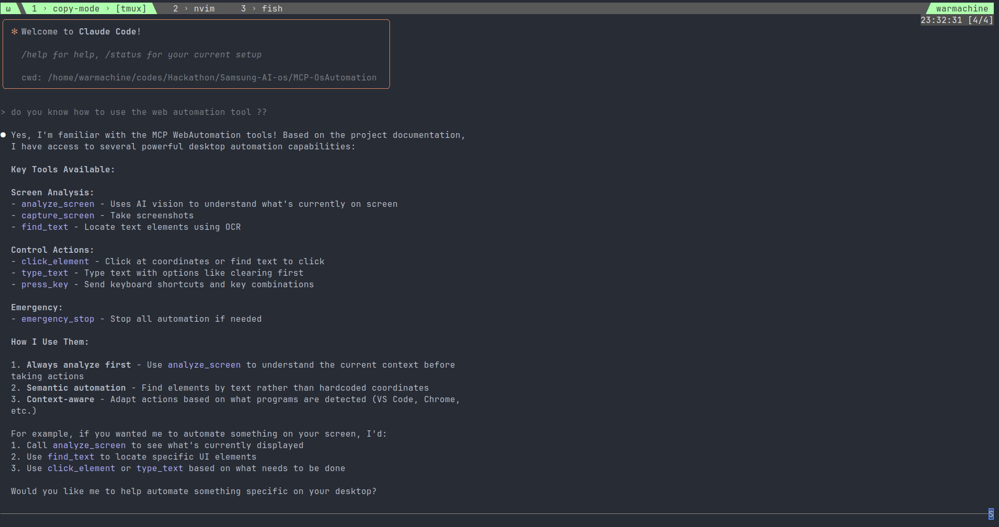

# AI OS

## Overview

Samsung AI OS represents a groundbreaking fusion of intelligent command-line interfaces and semantic desktop automation, establishing a new paradigm in human-computer interaction. This project combines two revolutionary components: a brand-agnostic AI CLI tool and an advanced Model Context Protocol (MCP) automation system, creating an unprecedented platform for intelligent system control and analysis.

#### NOTE: developed on Ubuntu 22.04 - (xorg) so haven't tested mcp screenshot on windows or mac

## Architecture

### Core Components

#### BlackIce CLI - Universal AI Command Interface
A sophisticated command-line AI assistant built on modified Gemini CLI architecture, designed for seamless integration with any existing CLI coding environment. This tool provides:

- **Universal Compatibility**: Integrates with any CLI-based development environment without brand dependencies
- **Advanced Language Model Access**: Direct terminal access to state-of-the-art AI capabilities
- **Extensible Tool Framework**: Built-in file operations, shell commands, and web connectivity
- **Model Context Protocol Support**: Native MCP integration for custom tool extensions
- **Non-Interactive Scripting**: Programmatic AI assistance for automated workflows

#### MCP-OsAutomation - Semantic Desktop Intelligence
A revolutionary desktop automation system that transcends traditional coordinate-based approaches through AI vision understanding:

- **LLM Vision Integration**: Utilizes GPT-4V, Claude, and Gemini for semantic screen analysis
- **Context-Aware Automation**: Understands applications, UI states, and user intent
- **Adaptive Execution**: Maintains functionality across UI changes, themes, and resolutions
- **Multi-Provider Architecture**: Intelligent fallback between vision models for maximum reliability
- **Cross-Platform Compatibility**: Universal desktop automation across operating systems

---

---


## Innovation and Market Position

### Unprecedented Integration
Samsung AI OS introduces the first-ever combination of semantic desktop automation with universal CLI AI assistance. While existing solutions operate in isolation, this platform creates a unified intelligence layer that bridges command-line operations with visual desktop interaction.

### Technical Breakthrough
Traditional automation systems rely on brittle coordinate-based scripts that break with minor UI changes. Samsung AI OS employs semantic understanding, where AI vision models comprehend screen content contextually, enabling robust automation that adapts to dynamic environments.

### Market Differentiation
No existing solution combines:
- Universal CLI AI integration without vendor lock-in
- Semantic desktop automation with LLM vision
- Model Context Protocol for extensible tool ecosystems
- Cross-platform compatibility with adaptive intelligence

## Synergistic Operations

### Unified Workflow Intelligence
When deployed together, the CLI and automation components create a comprehensive intelligent workspace:

1. **Command-Line Analysis**: The CLI tool analyzes system states, code repositories, and configurations
2. **Visual Context Integration**: The MCP automation system provides real-time desktop context
3. **Intelligent Decision Making**: Combined insights enable sophisticated automated workflows
4. **Adaptive Execution**: The system learns and adapts to user patterns and environmental changes

### Cross-Component Communication
The MCP protocol enables seamless data exchange between components, allowing the CLI tool to leverage desktop automation capabilities while the automation system can access command-line intelligence for enhanced decision-making.

## Use Cases and Applications

### Cybersecurity Analysis
- **Threat Assessment**: Automated security scanning with intelligent result analysis
- **Incident Response**: Rapid system state analysis and automated containment procedures
- **Vulnerability Management**: Intelligent patch assessment and deployment coordination
- **Forensic Analysis**: Automated evidence collection with context-aware documentation

### Development Operations
- **Intelligent Testing**: Automated UI testing that adapts to interface changes
- **Deployment Orchestration**: Smart deployment pipelines with visual verification
- **Code Review Automation**: Comprehensive analysis combining static analysis with runtime behavior
- **Environment Management**: Intelligent development environment setup and maintenance

### System Administration
- **Proactive Monitoring**: Intelligent system health assessment with predictive analytics
- **Automated Troubleshooting**: Context-aware problem diagnosis and resolution
- **Configuration Management**: Intelligent configuration drift detection and correction
- **Performance Optimization**: Automated performance tuning based on usage patterns

### Research and Development
- **Experimental Automation**: Intelligent experiment execution with adaptive parameters
- **Data Analysis Workflows**: Automated data processing with intelligent quality assessment
- **Documentation Generation**: Automatic documentation creation from system observation
- **Prototype Testing**: Rapid prototype evaluation with comprehensive feedback

### Enterprise Integration
- **Workflow Automation**: Complex business process automation with intelligent decision points
- **Quality Assurance**: Comprehensive testing frameworks with adaptive test case generation
- **Compliance Monitoring**: Automated compliance checking with intelligent reporting
- **Knowledge Management**: Intelligent information extraction and organization

## Technical Specifications

### System Requirements
- **Operating Systems**: Linux, macOS, Windows
- **Runtime**: Node.js 20+ (CLI), Python 3.8+ (MCP)
- **Memory**: Minimum 4GB RAM, 8GB recommended
- **Storage**: 2GB available space for full installation

### API Integration
- **Language Models**: OpenAI GPT-4V, Anthropic Claude, Google Gemini
- **Protocols**: Model Context Protocol (MCP), FastMCP 2.0
- **Interfaces**: RESTful APIs, WebSocket connections, STDIO transport

### Security Features
- **Rate Limiting**: Intelligent request throttling for API protection
- **Permission Management**: Granular access control for system operations
- **Secure Communication**: Encrypted data transmission between components
- **Audit Logging**: Comprehensive activity logging for security analysis

## Getting Started

### Quick Installation
```bash
# Clone the repository
git clone https://github.com/your-org/Samsung-AI-os.git
cd Samsung-AI-os

# Initialize submodules
git submodule update --init --recursive

# Setup CLI component
cd blackice-cli
npm install
npm run build

# Setup MCP automation
cd ../MCP-OsAutomation
uv sync
```

### Configuration
1. **API Keys**: Configure language model API keys in respective `.env` files
2. **MCP Integration**: Update Claude Code configuration for MCP server connectivity
3. **Permissions**: Set appropriate system permissions for desktop automation

### Basic Usage
```bash
# Start CLI assistant
blackice

# Test MCP automation
uv run python MCP-OsAutomation/start_server.py --test

# Integrated workflow example
blackice -p "Analyze the current desktop state and suggest optimizations"
```

## Future Roadmap

### Enhanced Intelligence
- Advanced multi-modal reasoning capabilities
- Predictive workflow automation
- Self-improving system optimization

### Extended Integration
- Support for additional language models
- Enhanced enterprise tool integration
- Advanced security and compliance features

### Platform Expansion
- Mobile device integration
- Cloud-native deployment options
- Distributed system coordination

## Contributing

Samsung AI OS is designed for collaborative development. Contributions are welcome in areas including:
- Core functionality enhancement
- New use case development
- Security and performance optimization
- Documentation and testing

## License

This project is licensed under the Apache License 2.0, ensuring open collaboration while maintaining appropriate attribution and liability protection.

---

Samsung AI OS represents the future of intelligent system interaction, combining the precision of command-line control with the intuition of visual understanding to create unprecedented automation capabilities.