# 🛡️ Samsung AI-OS | Voice-Controlled Cybersecurity Platform

<div align="center">

**Next-generation Kali Linux with AI-powered voice control for cybersecurity operations**

[](LICENSE)
[](https://python.org/downloads/)
[](https://fastapi.tiangolo.com/)
[](https://docker.com/)

</div>

## 🚀 What is Samsung AI-OS?

Samsung AI-OS transforms cybersecurity workflows by combining the power of Kali Linux with voice-controlled AI automation. Speak naturally to execute complex security operations, automate penetration testing, and manage multiple tools simultaneously.

```bash
# Traditional approach
$ nmap -sS -A -O target.com && nikto -h target.com && gobuster dir -u target.com

# Samsung AI-OS approach
🗣️ "Scan target.com with nmap stealth scan, run nikto, and enumerate directories"
```

## ⚡ Key Features

| Feature | Description |
|---------|-------------|
| 🎤 **Voice Control** | Natural language commands for all security tools |
| 🧠 **AI Processing** | Google GenAI integration for intelligent automation |
| 🔐 **Secure Auth** | Encrypted API key management with zero-trust architecture |
| 🖥️ **Dual Desktop** | Separate AI workspace to prevent user interference |
| 🛠️ **Universal Tools** | 600+ Kali tools + custom security applications |
| 🎯 **Smart Automation** | Multi-stage attack workflows with intelligent coordination |

## 🏗️ Architecture

The system follows a clean separation of concerns with secure communication flow between components:

```mermaid
sequenceDiagram
    participant User
    participant KaliOS as Kali AI-OS
    participant AuthServer as Authentication Server
    participant AIEngine as AI Processing
    participant SecurityTools as Security Tools

    Note over User,SecurityTools: 1. AUTHENTICATION PHASE
    User->>KaliOS: "Login as security_expert"
    KaliOS->>AuthServer: POST /auth/login {username, password}
    AuthServer->>AuthServer: Validate credentials + retrieve encrypted keys
    AuthServer->>KaliOS: {success: true, encrypted_keys: "...", session_token: "..."}
    KaliOS->>KaliOS: Decrypt keys to RAM only (never disk)
    KaliOS->>User: "Authentication successful! AI services ready."

    Note over User,SecurityTools: 2. VOICE COMMAND PROCESSING
    User->>KaliOS: "Open Burp Suite and scan example.com"
    KaliOS->>KaliOS: Voice → Text → Intent Recognition
    KaliOS->>KaliOS: Safety validation + ethical checks
    KaliOS->>AIEngine: Process command with decrypted API keys
    AIEngine->>AIEngine: Generate GUI automation workflow

    Note over User,SecurityTools: 3. DESKTOP AUTOMATION EXECUTION
    KaliOS->>KaliOS: Switch to AI virtual desktop (:1)
    KaliOS->>SecurityTools: Automate Burp Suite GUI (click, type, configure)
    SecurityTools->>KaliOS: Tool ready + scan initiated
    KaliOS->>AIEngine: Process scan results
    AIEngine->>KaliOS: Generate natural language summary
    KaliOS->>User: "Burp Suite configured and scanning. Found 3 potential vulnerabilities..."
```



## 🎯 Components

### Core Systems
- **[Authentication Server](auth-server/)** - Secure API key management with FastAPI
- **[Voice Engine](kali-ai-os/)** - Speech recognition and natural language processing
- **Desktop Automation** - GUI control for any security application
- **AI Processing** - Command interpretation and workflow orchestration

### Security Features
- **Zero Trust Model** - API keys never stored on disk in VM
- **Isolated Execution** - Dual desktop prevents interference
- **Complete Audit Trail** - All actions logged and monitored
- **Safety Framework** - Ethical constraints and legal compliance

## 🚀 Quick Start

```bash
# 1. Clone repository
git clone https://github.com/your-org/Samsung-AI-os.git
cd Samsung-AI-os

# 2. Start authentication server
cp .env.example .env  # Configure your API keys
docker compose up -d

# 3. Setup Kali AI-OS (in VM)
cd kali-ai-os
curl -LsSf https://astral.sh/uv/install.sh | sh
uv sync --all-extras

# 4. Launch voice-controlled interface
uv run python main.py

# 5. Start speaking!
🗣️ "Computer, scan 192.168.1.1 for open ports"
```

## 📚 Documentation

| Resource | Description |
|----------|-------------|
| **[System Architecture](docs/system_architecture.md)** | Complete technical overview and component interaction |
| **[Voice Transcription](docs/voice_transcription.md)** | Speech recognition and natural language processing |
| **[Task Breakdown](tasks/)** | Step-by-step implementation guides for each component |
| **[Development Workflow](DEVELOPMENT_WORKFLOW.md)** | Contributor guidelines and development practices |

## 🛠️ Implementation Tasks

| Task | Component | Status |
|------|-----------|--------|
| **[Task 1](tasks/task1_auth_server.md)** | Authentication Server | ✅ Complete |
| **[Task 2](tasks/task2_voice_engine.md)** | Voice Recognition Engine | ✅ Complete |
| **[Task 3](tasks/task3_desktop_automation.md)** | Desktop Automation | 🔄 In Progress |
| **[Task 4](tasks/task4_ai_processing.md)** | AI Processing Layer | 📋 Planned |
| **[Task 5](tasks/task5_security_tools.md)** | Security Tool Integration | 📋 Planned |

## 🔧 Technology Stack

- **Backend**: FastAPI, PostgreSQL, SQLAlchemy, Redis
- **AI/ML**: Google Generative AI, Vosk STT, PicoVoice Wake Word
- **Desktop**: PyAutoGUI, OpenCV, X11 Virtual Displays
- **Security**: JWT Authentication, Fernet Encryption, bcrypt
- **Infrastructure**: Docker Compose, uv Package Manager

## 🤝 Contributing

We welcome contributions! Please see our [Development Workflow](DEVELOPMENT_WORKFLOW.md) for:
- Setting up the development environment
- Code standards and testing requirements
- Pull request process
- Security considerations

## ⚖️ Legal & Ethics

Samsung AI-OS is designed for **authorized security testing only**. Users must:
- ✅ Have explicit permission for all target systems
- ✅ Comply with local laws and regulations
- ✅ Follow responsible disclosure practices
- ❌ Never use for malicious purposes

## 📄 License

This project is licensed under the Creative Commons Attribution-NonCommercial 4.0 International License - see the [LICENSE](LICENSE) file for details.

---

<div align="center">

**Built for Samsung Hackathon 2024**
*Revolutionizing cybersecurity through AI-powered voice control*

[🔗 Documentation](docs/) • [🚀 Quick Start](#quick-start) • [🤝 Contributing](DEVELOPMENT_WORKFLOW.md)

</div>
