# 🏗️ System Architecture

### Separated System Architecture Overview

The system is cleanly divided into two distinct components that communicate securely:

#### 1. **External Authentication Server** (Your Secure Backend)
- Independent FastAPI server hosting encrypted API keys
- User database and session management
- Completely separate from the Kali AI-OS

#### 2. **Kali AI-OS** (The Operating System)
- Modified Kali Linux with voice-controlled AI capabilities
- Receives encrypted keys from auth server (never stores them)
- Performs all cybersecurity operations locally

---

### Authentication Server Architecture

---

### Complete Kali AI-OS System Architecture

---

### Clean System Communication Flow

```mermaid
sequenceDiagram
    participant User
    participant KaliOS as Kali AI-OS
    participant AuthServer as Authentication Server
    participant AIEngine as AI Processing
    participant SecurityTools as Security Tools

    Note over User,SecurityTools: 1. AUTHENTICATION PHASE

    User->>KaliOS: "Login as security_expert"
    KaliOS->>AuthServer: POST /auth/login {username, password}
    AuthServer->>AuthServer: Validate credentials + retrieve encrypted keys
    AuthServer->>KaliOS: {success: true, encrypted_keys: "...", session_token: "..."}
    KaliOS->>KaliOS: Decrypt keys to RAM only (never disk)
    KaliOS->>User: "Authentication successful! AI services ready."

    Note over User,SecurityTools: 2. VOICE COMMAND PROCESSING

    User->>KaliOS: "Open Burp Suite and scan example.com"
    KaliOS->>KaliOS: Voice → Text → Intent Recognition
    KaliOS->>KaliOS: Safety validation + ethical checks
    KaliOS->>AIEngine: Process command with decrypted API keys
    AIEngine->>AIEngine: Generate GUI automation workflow

    Note over User,SecurityTools: 3. DESKTOP AUTOMATION EXECUTION

    KaliOS->>KaliOS: Switch to AI virtual desktop (:1)
    KaliOS->>KaliOS: Validate action permissions (PermissionGuard)
    KaliOS->>KaliOS: Ensure display isolation (IsolationManager)
    KaliOS->>SecurityTools: Template matching + OCR text recognition
    KaliOS->>SecurityTools: Automate Burp Suite GUI (click, type, configure)
    SecurityTools->>KaliOS: Tool ready + scan initiated
    KaliOS->>AIEngine: Process scan results with OCR analysis
    AIEngine->>KaliOS: Generate natural language summary
    KaliOS->>User: "Burp Suite configured and scanning. Found 3 potential vulnerabilities..."

    Note over User,SecurityTools: 4. SESSION MANAGEMENT

    KaliOS->>KaliOS: Monitor user activity (concurrent desktop access)
    KaliOS->>AuthServer: Periodic session refresh
    AuthServer->>KaliOS: Extended session or timeout
    KaliOS->>KaliOS: Auto-wipe keys on timeout/shutdown
```

### Clear Separation Benefits

#### Authentication Server (Backend)
- **Independent Operation**: Runs separately from Kali AI-OS
- **Centralized Security**: All API key management in one secure location
- **Scalable Access**: Can serve multiple Kali AI-OS instances
- **Enterprise Control**: Admin dashboard, user management, audit trails

#### Kali AI-OS (Operating System)
- **Zero Trust Model**: Never stores API keys permanently
- **Local Processing**: Voice recognition and GUI automation handled locally
- **Isolated Execution**: Dual desktop prevents user interference with strict monitoring
- **Complete Security**: All cybersecurity tools integrated with voice control
- **Advanced Recognition**: Dual-mode GUI recognition (OpenCV templates + OCR text)
- **Safety Systems**: Multi-layer security with emergency stop and permission validation
- **Production Ready**: Systemd service with automated deployment and performance monitoring
- **Performance Validated**: <100ms response time, <512MB memory usage guaranteed

#### Clean Communication
- **Simple API**: Only 4 endpoints needed (/login, /refresh, /logout, /status)
- **Secure Transport**: HTTPS + JWT tokens for all communication
- **Memory-Only Keys**: API keys never touch disk on Kali AI-OS
- **Automatic Cleanup**: Keys wiped on timeout, logout, or shutdown
